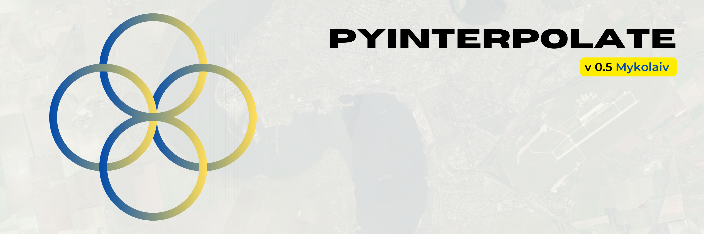
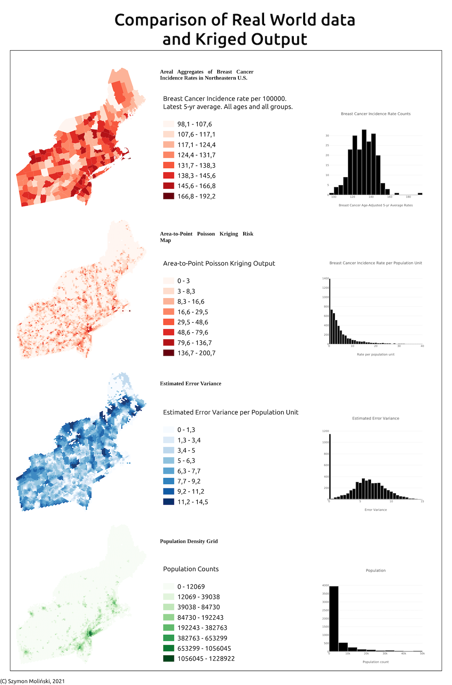

   [](https://www.codefactor.io/repository/github/dataverselabs/pyinterpolate)

# Pyinterpolate

**version 1.0.2**



## Important notice

The package was updated to version 1.0 in June 2025. There are breaking API changes, so please, refer to the [CHANGELOG](https://github.com/DataverseLabs/pyinterpolate/blob/main/CHANGELOG.rst) to know more about the changes.
Right now, the package in version 1.0.0 is in the **beta** stage, which means that it is stable but be careful with the production use. There might be some minor bugs, and large swaths of code are not optimized yet. If you find any bugs, please report them in the [issue tracker](https://github.com/DataverseLabs/pyinterpolate/issues).

## Introduction

Pyinterpolate is the Python library for **spatial statistics**. The package provides access to spatial statistics tools (variogram analysis, Kriging, Poisson Kriging, Indicator Kriging, Inverse Distance Weighting).

If you’re:

- GIS expert
- Geologist
- Social scientist

Then you might find this package useful. The core functionalities of Pyinterpolate are spatial interpolation and spatial prediction for point and block datasets.

Pyinterpolate performs:

1. *Ordinary Kriging* and *Simple Kriging* - spatial interpolation from points
2. *Centroid-based Poisson Kriging* of polygons - spatial interpolation from blocks and regions
3. *Area-to-area* and *Area-to-point Poisson Kriging* of Polygons - spatial interpolation and data deconvolution from areas to points
4. *Indicator Kriging* - kriging based on probabilities
5. *Universal Kriging* - kriging with trend
6. *Inverse Distance Weighting* - benchmarking spatial interpolation technique
7. *Semivariogram regularization and deconvolution* - transforming variogram of areal data in regards to point support data
8. *Semivariogram modeling and analysis* - is your data spatially correlated? How do neighbors influence each other?

## How does it work?

The package has multiple spatial interpolation functions. The flow of analysis is usually the same for each method:

**[1.]** Load your dataset with `GeoPandas` or `numpy`.

```python
import geopandas as gpd


point_data = gpd.read_file('dem.gpkg')  # x (lon), y (lat), value
```

**[2.]** Pass loaded data to `pyinterpolate`, calculate experimental variogram.

```python
from pyinterpolate import ExperimentalVariogram


step_size = 500
max_range = 40000

experimental_variogram = ExperimentalVariogram(
    ds=point_data,
    step_size=step_size,
    max_range=max_range
) 
```

**[3.]** Fit experimental semivariogram to theoretical model, it is equivalent of the `fit()` method known from machine learning packages.

```python
from pyinterpolate import build_theoretical_variogram


sill = experimental_variogram.variance
nugget = 0
variogram_range = 8000

semivar = build_theoretical_variogram(
    experimental_variogram=experimental_variogram,
    models_group='linear',
    nugget=nugget,
    rang=variogram_range,
    sill=sill
)
```

**[4.]** Interpolate values in unknown locations.

```python
from pyinterpolate import ordinary_kriging


unknown_point = (20000, 65000)
prediction = ordinary_kriging(theoretical_model=semivar,
                              known_locations=point_data,
                              unknown_location=unknown_point,
                              no_neighbors=32)
```

**[5.]** Analyze error and uncertainty of predictions.

```python
print(prediction)  # [predicted, variance error, lon, lat]
```

```bash
>> [211.23, 0.89, 20000, 60000]
```

With Pyinterpolate you can analyze and transform aggregated data. Here is the example of spatial disaggregation of areal data into point support using Poisson Kriging:



## Status

Operational: no API changes in the current release cycle.


## Setup

Setup with *conda*: `conda install -c conda-forge pyinterpolate`

Setup with *pip*: `pip install pyinterpolate`

Detailed instructions on how to install the package are presented in the file [SETUP.md](https://github.com/DataverseLabs/pyinterpolate/blob/main/SETUP.md). We pointed out there most common problems related to third-party packages.

You may follow those setup steps to create a *conda* environment with the package for your work:

### Recommended - conda installation

[1.] Create conda environment with Python >= 3.10

```shell
conda create -n [YOUR ENV NAME] -c conda-forge python=3.10 pyinterpolate
```

[2.] Activate environment.

```
conda activate [YOUR ENV NAME]
```

[3.] You are ready to use the package!

### pip installation

With **Python>=3.9** and system ```libspatialindex_c.so``` dependencies you may install package by simple command:

```
pip install pyinterpolate
```

A world of advice, you should **always** use Virtual Environment for the installation. You may consider using PipEnv too.

## Tests and contribution

All tests are grouped in the `test` directory. If you would like to contribute, then you won't avoid testing, but it is described step-by-step here: [CONTRIBUTION.md](https://github.com/DataverseLabs/pyinterpolate/blob/main/CONTRIBUTION.md)

## Commercial and scientific projects where library has been used

* Tick-Borne Disease Detector (Data Lions company) for the European Space Agency (2019-2020).
* B2C project related to the prediction of demand for specific flu medications (2020).
* B2G project related to the large-scale infrastructure maintenance (2020-2021).
* E-commerce service for reporting and analysis, building spatial / temporal profiles of customers (2022+).
* The external data augmentation for e-commerce services (2022+).
* Regional aggregates transformation and preprocessing for location intelligence tasks (2025+).

## Community

Join our community in Discord: [Discord Server Pyinterpolate](https://discord.gg/3EMuRkj)


## Bibliography

Pyinterpolate was created thanks to many resources and all of them are pointed here:

- Armstrong M., Basic Linear Geostatistics, Springer 1998,
- GIS Algorithms by Ningchuan Xiao: https://uk.sagepub.com/en-gb/eur/gis-algorithms/book241284
- Pardo-Iguzquiza E., VARFIT: a fortran-77 program for fitting variogram models by weighted least squares, Computers & Geosciences 25, 251-261, 1999,
- Goovaerts P., Kriging and Semivariogram Deconvolution in the Presence of Irregular Geographical Units, Mathematical Geology 40(1), 101-128, 2008
- Deutsch C.V., Correcting for Negative Weights in Ordinary Kriging, Computers & Geosciences Vol.22, No.7, pp. 765-773, 1996


## How to cite

Moliński, S., (2022). Pyinterpolate: Spatial interpolation in Python for point measurements and aggregated datasets. Journal of Open Source Software, 7(70), 2869, https://doi.org/10.21105/joss.02869


## Requirements and dependencies (v 1.x)

Core requirements and dependencies are:

* Python >= 3.10
* geopandas
* matplotlib
* numpy
* prettytable
* pydantic
* scipy
* tqdm

You may check a specific version of requirements in the `setup.cfg` file. Required packages versions are updated in a regular interval.

## Package structure

High level overview:

 - [x] `pyinterpolate`
    - [x] `core` - data structures and models, data processing pipelines
    - [x] `distance` - distance and angles
    - [x] `evaluate` - cross-validation and modeling metrics
    - [x] `idw` - inverse distance weighting
    - [x] `kriging` - Ordinary Kriging, Simple Kriging, Poisson Kriging: centroid based, area-to-area, area-to-point, Indicator Kriging
    - [x] `transform` - internal data processing functions
    - [x] `semivariogram` - experimental variogram, theoretical variogram, variogram point cloud, semivariogram regularization & deconvolution, indicator variogram
    - [x] `viz` - interpolation of smooth surfaces from points into rasters.
 - [x] `tutorials`
   - [x] `api-examples` - tutorials covering the API
   - [x] `functional` - tutorials covering concrete use cases

## Datasets

Datasets and scripts to download spatial data from external API's are available in a dedicated package: **[pyinterpolate-datasets](https://pypi.org/project/pyinterpolate-datasets/2023.0.0/)**

## API documentation

https://pyinterpolate.readthedocs.io/en/latest/
