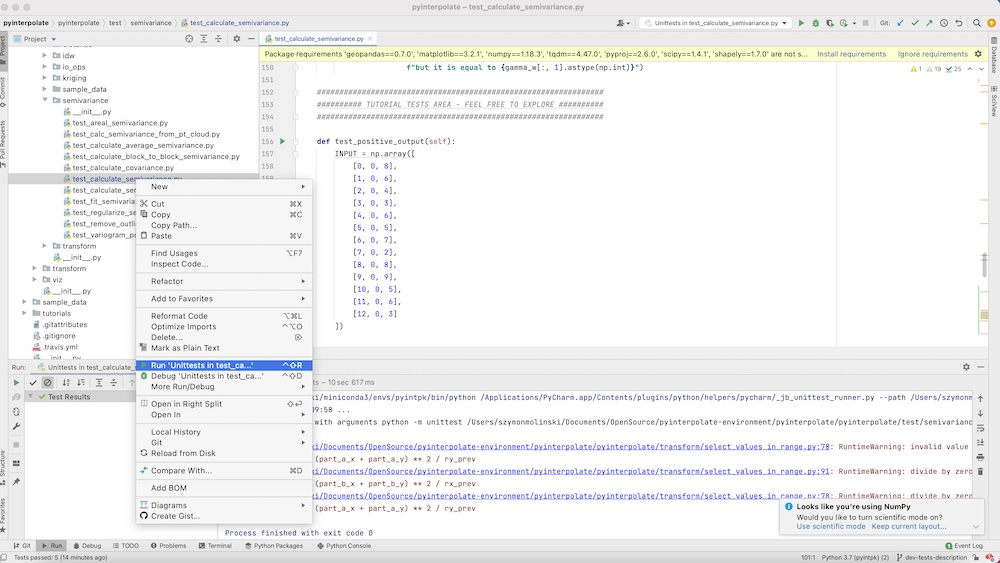
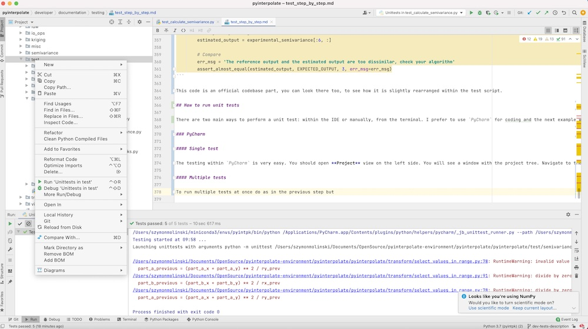

# Tests - step by step tutorial

In this tutorial we will create *unit* and *functional* tests for the code developed within **pyinterpolate** package.

## Changelog

| Date | Change description | Author |
|--------|--------------------------|----------|
| 2021-04-09 | First release of tutorial | @szymon-datalions |

## Contents

- [Introduction](#introduction)
- [(Optional) Example function](#example-function)
- [Unit Tests](#unit-tests)
- [Logical and Functionality Testing](#logical-and-functionality-testing)
- [How to run unit tests](#how-to-run-unit-tests)
  - [PyCharm](#pycharm)
    - [Single Test](#pycharm-single-test)
    - [Multiple Tests](#pycharm-multiple-tests)
  - [Console](#console)
    - [Single Test](#console-single-test)
    - [Multiple Tests](#console-multiple-tests)
- [Testing with tutorials](#test-with-tutorials)
- [Summary](#summary)

## Introduction

Every time when code is changed or new feature is added we should perform tests to ensure that everything works as it should be. We have few different levels of test to perform. List below represents all steps required to be sure that everyting works (hopefully) fine. Steps 1-2 and 4 are required for the new features, steps 3 and 4 are required for changes in a codebase.

1. Write unit tests in `test` directory to check if input data structure is valid or if returned values are within specific or or are of specific type. Use `unittests` package. Group tests in regards to the module within you're working. As example if you implement new Kriging technique put your tests inside `test/kriging` module. Name your test file with prefix `test_` and follow `unittest` naming of the testing functions and classes. This part is of tutorial is presented in the section [Unit tests](#unit-tests).
2. Write logical test where you know exactly what should be returned. This step is very important in the development of scientific software so pen & paper are equally important as keybord & monitor. Where it's possible use examples from the literature and try to achieve the same results with the same datasets. If this is not possible justify why function is usable and why your results are different than in the literature. If you are not sure what it all means then read part about [Logical and functionality testing](#logical-and-functionality-testing).
3. Run all tests within the `test` package. You have two options: use `PyCharm` or Python console. Those are described in depth in the section [How to run multiple unit tests](#how-to-run-multiple-unit-tests).
4. [Create testing `conda` environment with implemented and tested functionality](#test-with-tutorials). Update all tutorials where change / addition may affect calculation results. Remember to update **Changelog table** in recalculated tutorials.
5. (Optional) [Write a tutorial](#tutorial-as-a-test) which covers your functionality or code change.

To make things easier to understand we will go through the example of `calculate_seimvariance()` function.

## Example function

To start with the development we must first do two things:

1. Write an equation and / or create block diagram algorithm of the function,
2. Prepare dataset for logic tests.

Those two steps prepare our mental model. In the ideal situation we should have equation / algorithm blocks and sample data from publications. Fortunately for us experimental semivariogram calculation process is well described in the book **Basic Linear Geostatistics** written by *Margaret Armstrong* in 1998 (pages 47-52 for this tutorial). (If you're a geostatistican and you haven't read this book yet then do it as soon as you can. This resource is a gem among books for geostatistics and **Pyinterpolate** relies heavely on it).

Starting from the equation for experimental semivariogram:

$$\gamma'(h) = \frac{1}{2 * N(h)} \sum_{i=1}^{N(h)} [Z(x_{i} + h) - Z(x_{i})]^2$$

where $\gamma'(h)$ is a semivariance for a given lag $h$, $x_{i}$ are the locations of samples, $Z(x_{i})$ are their values and $N(h)$ is the number of pairs $(x_{i}, x_{i + h})$. What it means in practice? We may freely translate it to: **semivariance at a given interval of distances is a halved mean squared error of all points pairs which are in a given interval**. If we understand what it means then we could go further. To the block diagram of an algorithm. Here's a little digression: equations are not always available and sometimes we will implement processes and not single blocks. Take as an example genetic algorithms: they are very complex to desribe them with formal mathematical notation and we should consider text / diagram description in this case.

With a block diagram we may think of the first bunch of tests which should be implemented. Usually those tests check if an input data is valid and if results are valid. We may use algorithm presented in the page 49 in the **Basic Linear Geostatistics** but for the case of simplicity we create our own algorithm for omnidirectional semivariogram calculation. Algorithm works as follow:

(1) Read Data as an array of triplets `x, y, value`,

(2) Calculate distances between each element from the array,

(3) Create lags list to group semivariances (lags are separation distances $h$),

(4a) For each lag group calculated distances to select points within a specific range (lag),

(4b) Calculated mean squared error between all points pairs and divide it by two (each pair is taken twice a time),

(4c) Store calculated semivariance along the lag and number of points used for calculation within array `lag, semivariance, number of points`,

(5) Return array of lags and their semivariances.

At this point we should see specific dependencies and data structures which should be tested. We start from the *unit tests*.

## Unit tests

We will create simple unit test which checks if all results are positive numbers. (Lags can be only positive because there is no negative distance. The same for semivariance - due to the fact that it is a squared difference it must always be a positive number). First, let's create Python file within `test/semivariance`. All files with unit tests should have a prefix `test_`. That's why we name our file `test_calculate_semivariance` and full path to the file should be:

`pyinterpolate/test/semivariance/test_calculate_semivariance.py`

At the beginning we must import `calculate_semivariance()` method and `unittest` module.

```python
import unittest
from pyinterpolate.semivariance import calculate_semivariance
```

To write a test we must create **class** which starts with `Test` prefix. Usually it is named `TestYourFunctionOrModuleName`, in our case: `TestCalculateSemivariance`. This class inherits from the `unittest.TestCase` class. We can skip explanation what inheritance is. The key is to understand that we can use methods from `unittest.TestCase` in our class `TestCalculateSemivariance` and those methods allow us to write unit tests. Let's update our script with this new piece of information:

```python
import unittest
from pyinterpolate.semivariance import calculate_semivariance

class TestCalculateSemivariance(unittest.TestCase):

	def test_calculate_semivariance(self):
		pass
```

Good practice with unit testing is to have data which is not depended on the external sources or processes. In other words we use mostly static files with known datasets or artificial arrays. Those arrays may be filled with random numbers of specific distribution or hard-coded values which are simulating possible input. We are going to create one array for the sake of simplicity:

1. Array:

```python
INPUT = [8, 6, 4, 3, 6, 5, 7, 2, 8, 9, 5, 6, 3]
```

This array is not random. It comes from the **Basic Linear Geostatistic** and it is presented in the page 48. It has important property: **we are able to calculate semivariance _by hand_** and it will be a topic of functional testing scenario. Now we consider test if all output values are positive. `calculate_semivariance()` returns list of triplets: `[lag, semivariance, number of point pairs]`. First, calculate semivariances up to lag 5 by hand:

**Lag 0:**

Calculations: _n/a_

Expected output: `[0, 0, 13]`

**Lag 1:**

Calculations: 

$$\gamma(h_{1})= \frac{1}{2*24}*2(4+4+1+9+1+4+25+36+1+16+1+9)=\frac{111}{24}=4.625$$

Expected output: `[1, 4.625, 24]`

**Lag 2:**

Calculations:

$$\gamma(h_{2})= \frac{1}{2*22}*2(16+9+4+4+1+9+1+49+9+9+4)=\frac{115}{22}=5.227$$

Expected output: `[2, 5.227, 22]`

**Lag 3:**

Calculations:

$$\gamma(h_{3})= \frac{1}{2*20}*2(25+0+1+16+16+9+4+9+4+36)=\frac{120}{20}=6.0$$

Expected output: `[3, 6.0, 20]`

**Lag 4:**

Calculations:

$$\gamma(h_{4})= \frac{1}{2*18}*2(4+1+9+1+4+16+4+16+25)=\frac{80}{18}=4.444$$

Expected output: `[4, 4.444, 18]`

**Lag 5:**

$$\gamma(h_{5})= \frac{1}{2*16}*2(9+1+4+25+9+0+1+1)=\frac{50}{16}=3.125$$

Expected output: `[5, 5.0, 16]`

Now we prepare a static (constant) variable with the expected output values. At this step we import `numpy` to create output of the same type as the output returned by the `calculate_semivariance()` function.

```python
import unittest
from pyinterpolate.semivariance import calculate_semivariance

class TestCalculateSemivariance(unittest.TestCase):

	def test_calculate_semivariance(self):
		INPUT = [8, 6, 4, 3, 6, 5, 7, 2, 8, 9, 5, 6, 3]
		EXPECTED_OUTPUT = np.array([
			[0, 0, 13],
			[1, 4.625, 24],
			[2, 5.227, 22],
			[3, 6.0, 20],
			[4, 4.444, 18],
			[5, 3.125, 16]
		])
```

The first test is very simple: we should check if the output values from the function are positive. Thing is easy because each column from the output array MUST BE positive but we are going to focus only in the middle column with the experimental semivariance values. So let's begin testing! Tests in `Python` are written with the `assert` keyword. We use specific condition with this keyword, as example we are able to:

- check if values are equal,
- check if values are not equal,
- check if given value is True or False,
- check if function raises specific error,
- and more described (here)[https://docs.python.org/3/library/unittest.html#test-cases].

For the purpose of this tutorial we will perform simple test to check if all values of the output are greater than zero. `unittest` package has method `assertGreaterEqual(a, b)` which can be used to test it but we rather prefer `assertTrue()` to test if an expression is `True`. How are we going to test it? `numpy` has a great system to work with arrays and we can check any condition for a given array with the syntax:

```python
boolean_test = my_array[my_array >= 0]
```

Variable `boolean_test` is an array of the same size as `my_array` but with `True` and `False` values at the specific positions where condition has been met or hasn't. We can add method `.all()` to check if all values in boolean array are `True`:

```python
boolean_test = my_array[my_array >= 0]
boolean_output = boolean_test.all()
```

Then we can assert value to our test. In this case let's start with the artificial array `EXPECTED_OUTPUT` and even if we know that everything is ok we should test the output to be sure that the test is designed properly:

```python
import unittest
from pyinterpolate.semivariance import calculate_semivariance

class TestCalculateSemivariance(unittest.TestCase):

	def test_calculate_semivariance(self):
		INPUT = [8, 6, 4, 3, 6, 5, 7, 2, 8, 9, 5, 6, 3]
		EXPECTED_OUTPUT = np.array([
			[0, 0, 13],
			[1, 4.625, 24],
			[2, 5.227, 22],
			[3, 6.0, 20],
			[4, 4.444, 18],
			[5, 3.125, 16]
		])
		expected_output_values = EXPECTED_OUTPUT[:, 1].copy()
		
		boolean_test = (expected_output_values >= 0).all()
		
		assertTrue(boolean_test, 'Test failed. Calculated values are below zero which is non-physical. Check your data.')
```

Test should definitively pass but you may check what'll happen if you change one value to the negative number:

```python
import unittest
from pyinterpolate.semivariance import calculate_semivariance

class TestCalculateSemivariance(unittest.TestCase):

	def test_calculate_semivariance(self):
		INPUT = [8, 6, 4, 3, 6, 5, 7, 2, 8, 9, 5, 6, 3]
		EXPECTED_OUTPUT = np.array([
			[0, 0, 13],
			[1, 4.625, 24],
			[2, 5.227, 22],
			[3, -6.0, 20],
			[4, 4.444, 18],
			[5, 3.125, 16]
		])
		expected_output_values = EXPECTED_OUTPUT[:, 1].copy()
		
		boolean_test = (expected_output_values >= 0).all()
		
		self.assertTrue(boolean_test, 'Test failed. Calculated values are below zero which is non-physical. Check your data.')
```

Surprise!? We got the assertion error and it should inform us that we haven't implented something in a correct way. Let's remove the minus sign from the expected output lag's number 3 semivariance and now we should test the baseline function, and not the `EXPECTED_OUTPUT` variable. Function `calculate_semivariance(data, step_size, max_range)` has three parameters. From the (documentation)[https://pyinterpolate.readthedocs.io/en/latest/code_documentation/semivariance.html#calculate_semivariance()] we know that:

- `data` parameter is a _numpy array_ of coordinates and their values,
- `step_size` parameter is a distance between lags and has a `float` type,
- `max_range` is a maximum range of analysis and has a `float` type.

From this description we see that our `INPUT` variable is not what's expected by the algorithm. We will change it and we set `step_size` and `max_range` parameters within our test case and we remove `EXPECTED_OUTPUT` variable because **for this concrete test** we do not need it. We change a name of the unit test to the `test_positive_output(self)` to make it clear what we want to achieve with this test.

```python
import unittest
from pyinterpolate.semivariance import calculate_semivariance

class TestCalculateSemivariance(unittest.TestCase):

	def test_positive_output(self):
		INPUT = np.array([
			[0, 0, 8],
			[1, 0, 6],
			[2, 0, 4], 
			[3, 0, 3], 
			[4, 0, 6], 
			[5, 0, 5], 
			[6, 0, 7], 
			[7, 0, 2], 
			[8, 0, 8], 
			[9, 0, 9], 
			[10, 0, 5], 
			[11, 0, 6], 
			[12, 0, 3]
		])
		
		# Calculate experimental semivariance
		t_step_size = 1.1
		t_max_range = 6
		
		experimental_semivariance = calculate_semivariance(INPUT, t_step_size, t_max_range)
		
		boolean_test = (experimental_semivariance >= 0).all()
		
		self.assertTrue(boolean_test, 'Test failed. Calculated values are below zero which is non-physical.')
```

Terrific! We've performed our first unit test! (By the way: it is implemented in the package).

## Logical and functionality testing

The next type of testing is a functionality test. Do you remember how we've calculated semivariance manually in the previous part? Short summary of calculations is the `EXPECTED_OUTPUT` array from the last test:

```python
EXPECTED_OUTPUT = np.array([
			[0, 0, 13],
			[1, 4.625, 24],
			[2, 5.227, 22],
			[3, 6.0, 20],
			[4, 4.444, 18],
			[5, 3.125, 16]
		])
```

Now we are going to use it. Why? A unit test is important for the **software development** but the **scientific software development** is even more rigorous! We need to prove that our function works as expected for the wide range of scenarios. It is not an easy task. Some algorithms are not proven mathematically... But we have an advantage: geostatistics is a well-established discipline and we can use external sources and the pen and paper for testing.

We'd created functionality test in the previous example but we didn't use it. The idea create a simple example which can test if our program calculates semivariance correctly. We'd taken an example array from the literature and we calculated semivariance values for few lags by hand. We assume that the results are correct (if you are not sure check records with the book; but I couldn't assure you that everyone is wrong but your program). `EXPECTED_OUTPUT` array is a static entity against which we can compare results of our algorithm. We can distinguish few steps which need to be done for the logic test:

1. Get the reference input and create the reference output. This could be calculated manually, derived from the literature or estimated by the other program which produces the right output.
2. Store reference output as the script values or as the non-changing file. The key is to never change values in this output throughout the testing flow.
3. Estimate the expected output from the reference input with your algorithm.
4. Compare the expected output and the reference output. If both are the same (or very close) then test is passed.

A few steps of the functionality testing can be very misleading if we consider the complexity of the whole process. There are traps in here and sometimes it is hard to avoid them:

- the reference input covers very unusual scenario, as example it is created from the dataset with the uniform distribution but in reality data follows other types of distribution,
- the reference input and output do not exist or the reference data is not publicly available (frequent problem with publications),
- it's hard to calculate the reference output manually.

But the biggest, and the most dangerous problem which sometimes relates to the previous obstacles is the reference output assignation from the developed algorithm itself (we don't know the reference output and we create it from our algorithm itself...). Is it bad? Yes, it is. Is it sometimes only (fast and dirty) way of development? Yes, it is. But even in this scenario we usually perform some kind of *sanity check* against our belief how the output should look like. Let's put aside the dirty testing and come back to our case. We have the expected output and we have the reference input. With both we can create the functionality test within our package!

The code will be similar to the unit test, e.g.: there's the same building-logic behaind it. We define function within the class which inherits from `unittest.TestCase`. Within this function we define the **reference input** and the **reference output**. We run the algorithm on the **reference input** and compare results to the **reference output**. Numpy has special assertion methods and one of them is `asset_almost_equal()` which is very useful when we compare two arrays with floating-point precision. The code itself is presented below:

```python
import unittest
from numpy.testing import assert_almost_equal

from pyinterpolate.semivariance.semivariogram_estimation.calculate_semivariance import calculate_semivariance

class TestCalculateSemivariance(unittest.TestCase):
    """
    HERE COULD BE A THE PART FOR OTHER TESTS
    """
    def test_against_expected_value_1(self):

        REFERENCE_INPUT = np.array([
            [0, 0, 8],
            [1, 0, 6],
            [2, 0, 4],
            [3, 0, 3],
            [4, 0, 6],
            [5, 0, 5],
            [6, 0, 7],
            [7, 0, 2],
            [8, 0, 8],
            [9, 0, 9],
            [10, 0, 5],
            [11, 0, 6],
            [12, 0, 3]
        ])

        EXPECTED_OUTPUT = np.array([
			[0, 0, 13],
			[1, 4.625, 24],
			[2, 5.227, 22],
			[3, 6.0, 20],
			[4, 4.444, 18],
			[5, 3.125, 16]
		])

        # Calculate experimental semivariance
        t_step_size = 1
        t_max_range = 6

        experimental_semivariance = calculate_semivariance(REFERENCE_INPUT, t_step_size, t_max_range)

        # Get first five lags
        estimated_output = experimental_semivariance[:6, :]

        # Compare
        err_msg = 'The reference output and the estimated output are too dissimilar, check your algorithm'
        assert_almost_equal(estimated_output, EXPECTED_OUTPUT, 3, err_msg=err_msg)
```

This code is an official codebase part, you can look there too, to see how it is slightly rearranged within the test script.

## How to run unit tests

There are two main ways to perform a unit test: within the IDE or manually, from the terminal. I prefer to use `PyCharm` for coding and the next example will be shown in it.

### PyCharm

#### PyCharm Single test

The testing within `PyCharm` is very easy. You should open **Project** view on the left side. You will see a window with the project tree. Navigate to the specific file with unit tests, click right mouse button and select `Run Unittests in test_case_`. A test is under its way. After a while you will the test results in the bottom window.



#### PyCharm Multiple tests

To run multiple tests at once do as in the previous step but right-click on the directory with tests and select `Run Unittests in tests`. All tests for **Pyinterpolate** take about a minute to go.



### Console

A test from console is slightly more complex than from Ithe IDE. It is required to be within a test directory and to have installed all required packages - in the normal scenario those are installed within the virtual environment or the conda environment. Steps to perform tests are as follow:

1. Activate environment with the dependencies of a package.
2. Navigate to the directory with tests.

The next steps differ in the case if we'd like to test one script or every case.

#### Console Single test

* Navigate to the directory with a specific test.
* Run `Unittest` script:

```
python -m unittest test_calculate_semivariance
```

#### Console Multiple tests

* Navigate to the parent directory of tests which you want to cover.
* Run `Unittest` script:

```
python -m unittest
```

## Test with tutorials

**Pyinterpolate** follows a specific flow of development. At the beginning each feature is developed within the *Jupyter Notebook*. We build a function or class with the concrete example in mind. Then it is easy to transform a development notebook into a tutorial. About a half of tutorials were developed in this manner.
The next big thing with the tutorials is that we can perform **sanity checks** within them. There are bugs, especially logical, which are not covered by the single tests. Tutorials cover a large part of the workflow and it makes them a great resource for the program testing. Thus after implementation of new features or changes inside old features we always run **all affected** tutorials. Probably you saw that each tutorial has a changelog table and there are records related to the feature changes.
The development and testing within notebooks can be summarized in few steps:

1. Develop feature in the notebook. (Development)
2. Write a tutorial related to this feature. (Development)
3. After any change in the feature run tutorial to check if everything works fine. (Maintenance and Testing)
4. After development of the new features test affected tutorials if there are any. (Maintenance and Testing)

We strongly encourage any developer to use this pattern. It builds not only confidence about the proposed development but also the understanding of the covered topics, as semivariogram modeling, kriging and so on. **Running all tutorials before releases is mandatory, even if the changes shouldn't affect the workflow**.

## Summary

You have learned how to:

- write the unit test,
- write and prepare the functionality test,
- run tests from the IDE and console,
- use tutorials as the testing playground.

If you are still not sure about anything in this article then write an  within the package repository. We will answer all your questions!