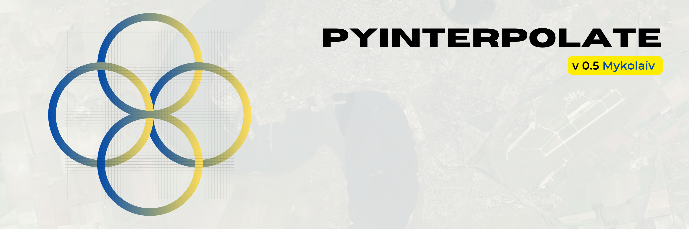
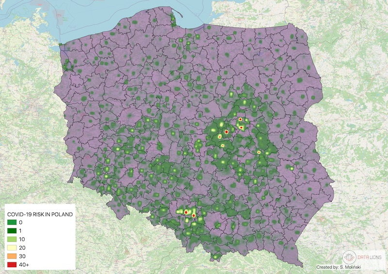

.. Pyinterpolate documentation master file, created by
   sphinx-quickstart on Sat Sep  3 10:43:29 2022.
   You can adapt this file completely to your liking, but it should at least
   contain the root `toctree` directive.

Pyinterpolate
=============

**version 0.5.4** - *Mykolaiv*
------------------------------------

.. note::
   The last documentation update: *2025-01-04*

**Pyinterpolate** is the Python library for **geostatistics**. The package provides access to spatial statistics tools used in various studies. This package helps you **interpolate spatial data** with the *Kriging* technique.

If you’re:

- GIS expert,
- geologist,
- mining engineer,
- ecologist,
- public health specialist,
- data scientist.

Then this package may be useful for you. You could use it for:

- spatial interpolation and spatial prediction,
- alone or with machine learning libraries,
- for point observations and aggregated data.

Pyinterpolate allows you to perform:

1. *Ordinary Kriging* and *Simple Kriging* (spatial interpolation from points),
2. *Centroid-based Poisson Kriging* of polygons (spatial interpolation from blocks and areas),
3. *Area-to-area* and *Area-to-point Poisson Kriging* of Polygons (spatial interpolation and data deconvolution from areas to points).
4. *Inverse Distance Weighting*.
5. *Semivariogram regularization and deconvolution*.
6. *Semivariogram modeling and analysis*.

With ``pyinterpolate`` we can retrieve the point support model from blocks. The example is COVID-19 population at risk mapping. Countries worldwide aggregate disease data to protect the privacy of infected people. But this kind of representation introduces bias to the decision-making process. To overcome this bias, you may use Poisson Kriging. Block aggregates of COVID-19 infection rate are transformed into the point support created from population density blocks. We get the population at risk map:

Contents
--------

.. toctree::
   :maxdepth: 1

   setup/setup
   usage/quickstart
   usage/tutorials
   science/cite
   api/api
   developer/dev
   community/community
   usage/learning_materials
   science/biblio

How to cite
-----------
Moliński, S., (2022). Pyinterpolate: Spatial interpolation in Python for point measurements and aggregated datasets. Journal of Open Source Software, 7(70), 2869, https://doi.org/10.21105/joss.02869
