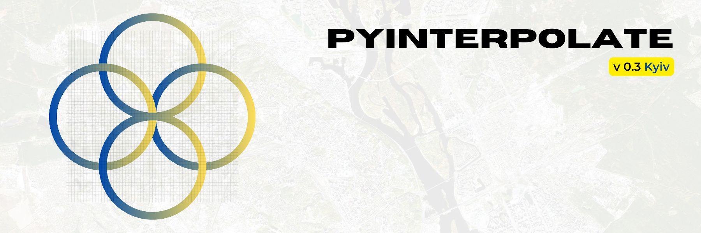

.. Pyinterpolate documentation master file, created by
   sphinx-quickstart on Sat Sep  3 10:43:29 2022.
   You can adapt this file completely to your liking, but it should at least
   contain the root `toctree` directive.

Pyinterpolate
=============

**version 0.3.0** - *Kyiv*
---------------------------------------

.. note::
   The last documentation update: *2022-09-13*

**Pyinterpolate** is the Python library for **geostatistics**. The package provides access to spatial statistics tools used in various studies. This package helps you **interpolate spatial data** with the *Kriging* technique.

If you’re:

- GIS expert,
- geologist,
- mining engineer,
- ecologist,
- public health specialist,
- data scientist.

Then this package may be useful for you. You could use it for:

- spatial interpolation and spatial prediction,
- alone or with machine learning libraries,
- for point observations and aggregated data.

Pyinterpolate allows you to perform:

1. *Ordinary Kriging* and *Simple Kriging* (spatial interpolation from points),
2. *Centroid-based Poisson Kriging* of polygons (spatial interpolation from blocks and areas),
3. *Area-to-area* and *Area-to-point Poisson Kriging* of Polygons (spatial interpolation and data deconvolution from areas to points).
4. *Inverse Distance Weighting*.
5. *Semivariogram regularization and deconvolution*.
6. *Semivariogram modeling and analysis*.

With ``pyinterpolate`` we can retrieve the point support model from blocks. The example is COVID-19 population at risk mapping. Countries worldwide aggregate disease data to protect the privacy of infected people. But this kind of representation introduces bias to the decision-making process. To overcome this bias, you may use Poisson Kriging. Block aggregates of COVID-19 infection rate are transformed into the point support created from population density blocks. We get the population at risk map:

.. image:: imgs/deconvoluted_risk_areas.jpg
  :alt: Covid-19 infection risk in Poland for 14th April, 2020.

Contents
--------

.. toctree::
   :maxdepth: 1

   setup/setup
   usage/quickstart
   usage/tutorials

Status
------

Beta (late) version: the structure will be in most cases stable, new releases will introduce new classes and functions instead of API changes.

Tests and contribution
------------------------

All tests are grouped in the ``test`` directory. If you would like to contribute, then you won't avoid testing, but it is described step-by-step here: `CONTRIBUTION.md <https://github.com/DataverseLabs/pyinterpolate/blob/main/CONTRIBUTION.md>`_

Commercial and scientific projects where library has been used
--------------------------------------------------------------

* Tick-Borne Disease Detector (Data Lions company) for the European Space Agency (2019-2020).
* B2C project related to the prediction of demand for specific flu medications (2020),
* B2G project related to the large-scale infrastructure maintenance (2020-2021),
* E-commerce reporting and analysis, building a spatial / temporal profile of customer (2022+),

Community
---------

Join our community in Discord: `Discord Server Pyinterpolate <https://discord.gg/3EMuRkj>`_

Bibliography
------------

Pyinterpolate was created thanks to many resources and some of them are pointed here:

- Armstrong M., Basic Linear Geostatistics, Springer 1998,
- GIS Algorithms by Ningchuan Xiao: https://uk.sagepub.com/en-gb/eur/gis-algorithms/book241284
- Pardo-Iguzquiza E., VARFIT: a fortran-77 program for fitting variogram models by weighted least squares, Computers & Geosciences 25, 251-261, 1999,
- Goovaerts P., Kriging and Semivariogram Deconvolution in the Presence of Irregular Geographical Units, Mathematical Geology 40(1), 101-128, 2008
- Deutsch C.V., Correcting for Negative Weights in Ordinary Kriging, Computers & Geosciences Vol.22, No.7, pp. 765-773, 1996

How to cite
-----------
Moliński, S., (2022). Pyinterpolate: Spatial interpolation in Python for point measurements and aggregated datasets. Journal of Open Source Software, 7(70), 2869, https://doi.org/10.21105/joss.02869

Requirements and dependencies (v 0.3.0)
---------------------------------------

Core requirements and dependencies are:

* Python >= 3.7
* descartes
* geopandas
* matplotlib
* numpy
* tqdm
* pyproj
* scipy
* shapely
* fiona
* rtree
* prettytable
* pandas
* dask
* requests

You may check a specific version of requirements in the ``setup.cfg`` file.

Package structure
-----------------

High level overview:

 - [x] ``pyinterpolate``
    - [x] ``distance`` - distance calculation,
    - [x] ``idw`` - inverse distance weighting interpolation,
    - [x] ``io`` - reads and prepares input spatial datasets,
    - [x] ``kriging`` - Ordinary Kriging, Simple Kriging, Poisson Kriging: centroid based, area-to-area, area-to-point,
    - [x] ``pipelines`` - a complex functions to smooth a block data, download sample data, compare different kriging techniques, and filter blocks,
    - [x] ``processing`` - core data structures of the package: ``Blocks`` and ``PointSupport``, and additional functions used for internal processes,
    - [x] ``variogram`` - experimental variogram, theoretical variogram, variogram point cloud, semivariogram regularization & deconvolution,
    - [x] ``viz`` - interpolation of smooth surfaces from points into rasters.
 - [x] ``tutorials`` - tutorials (Basic, Intermediate and Advanced).

Development
------------------

- API documentation,
- Dedicated webpage,
- Check Issues and TODOs :)

Known Bugs
-----------------

- *(sector clear)*
