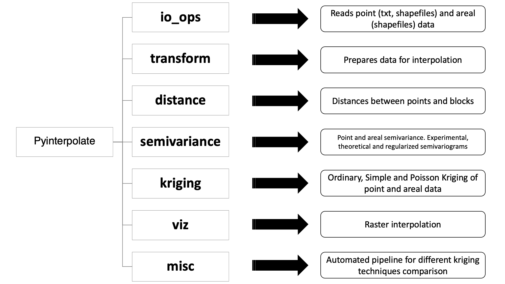
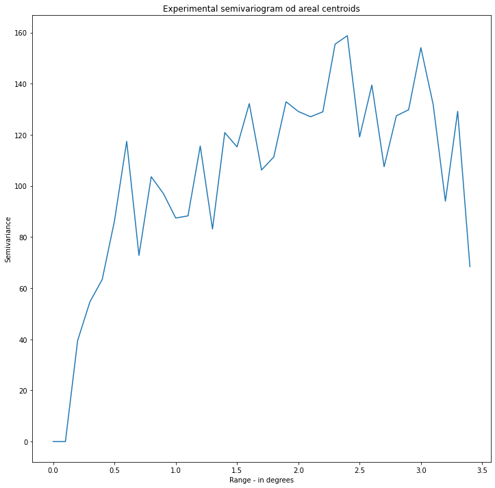
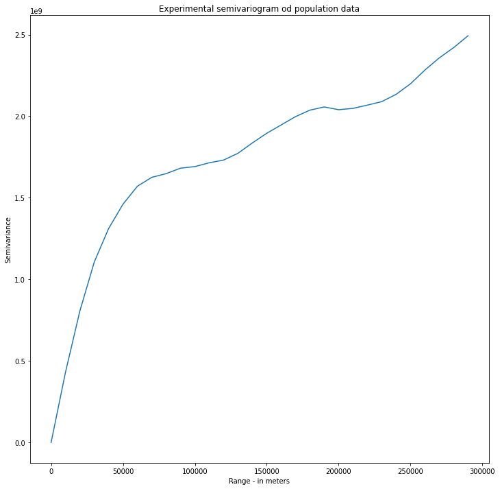
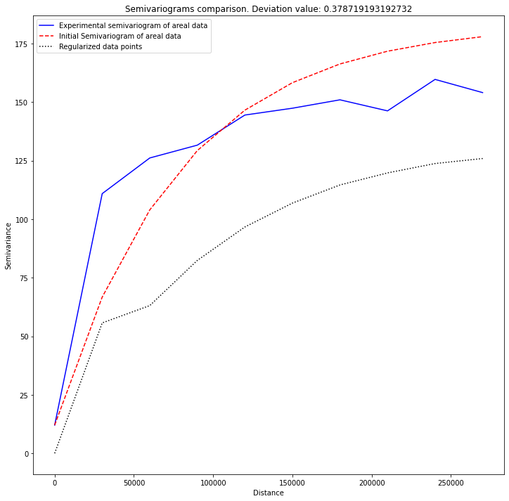
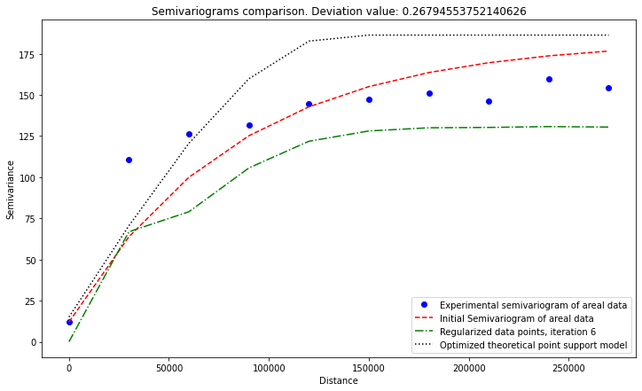
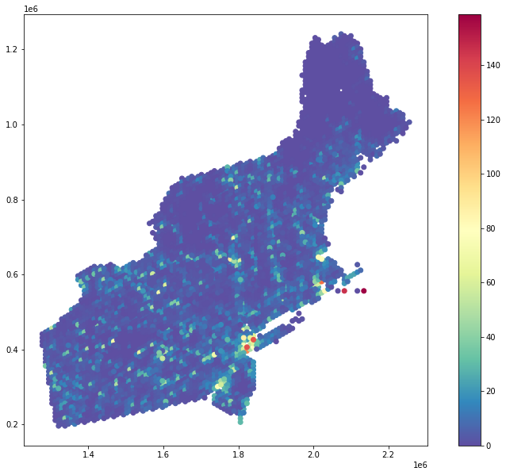
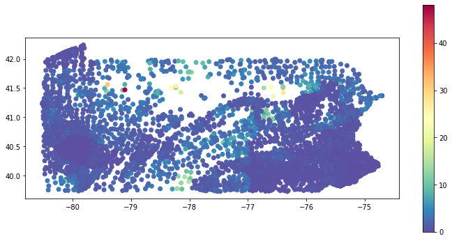

# Summary

Spatial Interpolation techniques are used to retrieve data at unknown locations from point observations and/or areal aggregates. The basic idea is that measurement at one location is a function of weighted distance between this place and its neighbors. It is known as the Tobler's First Law of Geography, which states: *everything is related to everything else, but near things are more related than distant things* [@Tobler:1970]. Important method of spatial interpolation is Kriging, which initially was designed for mining applications. Today this technique is much more complex, and it can be applied to problems of environmental science, hydrogeology, natural resources monitoring, remote sensing and epidemiology [@Chilès:2018]. Kriging is usually applied to point measurements and regular blocks, but nowdays it could be used with areal data of irregular shapes and sizes [@Goovaerts:2007].

# Statement of need

Pyinterpolate is a Python package for spatial interpolation and it is designed to perform predictions from point measurements and areal aggregates of different sizes and shapes. Pyinterpolate automates tasks performed by spatial statisticians, it helps with data exploration, semivariogram estimation and kriging predictions. It allows researchers to perform semivariogram deconvolution in presence of irregular administrative units and to apply Poisson Kriging to areal counts. This type of Kriging is widely used in the social sciences, epidemiology and spatial statistics [@Goovaerts:2007; @Goovaerts:2008; @Kerry:2013].

Package performs five types of spatial interpolation: Ordinary Kriging and Simple Kriging (point data), Centroid-based Poisson Kriging, Area-to-Area Poisson Kriging and Area-to-Point Poisson Kriging (areal data). Point observation analysis requires manual or automatic semivariogram fitting to predict missing values. Areal analysis requires additional step of semivariogram deconvolution and/or areal centroids calculation. Package performs those steps automatically. User has options to control prediction flow. Package was initially developed for epidemiological study, where areal aggregates of infections were transformed to point support population-at-risk maps and multiple potential applications follow this algorithm. Initial field of study (epidemiology) was the reason behind automation of many tasks related to the data modeling. It is assumed that user without wide geostatistical background may use Pyinterpolate for spatial data modeling and analysis.

## Other packages for spatial interpolation

PyInterpolate is one package from large ecosystem of spatial modeling and spatial interpolation packages written in Python. The main difference between Pyinterpolate and other packages is focus on areal deconvolution methods and Poisson Kriging techniques useful for ecology, social science and public health studies in the presented package. Potential users may choose other packages if their study is limited to point data interpolation.

The most similar and most important package from Python environment is **PyKrige** [@benjamin_murphy_2020_3991907]. PyKrige is designed especially for point kriging. PyKrige supports 2D and 3D ordinary and universal Kriging. User is able to incorporate own semivariogram models and/or use external functions (as example from **scikit-learn** package [@scikit-learn]) to model drift in universal Kriging. Package is well designed, and it is actively maintained.

**GRASS GIS** [@GRASS_GIS_software] is well-established software for vector and raster data processing and analysis. GRASS contains multiple modules and GRASS functionalities can be accessed from multiple interfaces: GUI, command line, C API, Python APU, Jupyter Notebooks, web, QGIS and R. GRASS has two functions for spatial interpolation: ```r.surf.idw``` and ```v.surf.idw```. Both use Inverse Distance Weighting technique, first interpolates raster files and second vectors (points).

**PySAL** is next GIS / geospatial package which can be used to interpolate missing values – but this time at areal scale. Package’s **tobler** module can be used to interpolate areal values of specific variable at different scales and sizes of support [@eli_knaap_2020_4385980]. Moreover, package has functions for multisource regression, where raster data is used as auxiliary information to enhance interpolation results. Conceptually tobler package is close to the pyinterpolate, where main algorithm transforms areal data into point support derived from auxiliary variable.

**R programming language** offers **gstat** package for spatial interpolation and spatial modeling [@PEBESMA2004683]. Package is designed for variogram modelling, simple, ordinary and universal point or block kriging (with drift), spatio-temporal kriging and sequential Gaussian (co)simulation. Gstat is a solid package for Kriging and spatial interpolation and has the largest number of methods to perform spatial modelling. The main difference between gstat and pyinterpolate is availability of area-to-point Poisson Kriging based on the algorithm proposed by Goovaerts [@Goovaerts:2007] in the latter.

# Spatial Interpolation

Kriging, which is baseline of the Pyinterpolate package, is an estimation method that gives the best unbiased linear estimates of point values or block averages [@Armstrong:1998]. Kriging minimizes variance of a dataset with missing values. Baseline technique is the Ordinary Kriging where value at unknown location $\hat{z}$ is estimated as a linear combination of $K$ neighbors with value $z$ and weights $\lambda$ assigned to those neighbors (1).

(1)
$$\hat{z} = \sum_{i=1}^{K}\lambda_{i}*z_{i}$$

Weights $\lambda$ are a solution of following system of linear equations (2):

(2)
$$\sum_{j=1}\lambda_{j} C(x_{i}, x_{j}) - \mu = \bar{C}(x_{i}, V); i=1, 2, ..., K$$
$$\sum_{i}\lambda_{i} = 1$$

where $C(x_{i}, x_{j})$ is a covariance between points $x_{i}$ and $x_{j}$, $\bar{C}(x_{i}, V)$ is an average covariance between point $x_{i}$ and all other points in a group ($K$ points) and $\mu$ is a process mean. The same system may be solved with **semivariance** instead of **covariance** (3):

(3)
$$\sum_{j=1}\lambda_{j} \gamma(x_{i}, x_{j}) + \mu = \bar{\gamma}(x_{i}, V); i=1, 2, ..., K$$
$$\sum_{i}\lambda_{i} = 1$$

where $\gamma(x_{i}, x_{j})$ is a semivariance between points $x_{i}$ and $x_{j}$, $\bar{\gamma}(x_{i}, V)$ is an average semivariance between point $x_{i}$ and all other points.

Semivariance is a key concept of spatial interpolation. It is a measure of a dissimilarity between observations in a function of distance. Equation (4) is a semivariance estimation formula and \autoref{fig2} and \autoref{fig3} show realization of experimental semivariogram.

(4)
$$\frac{1}{2N}\sum_{i}^{N}(z_{(x_{i} + h)} - z_{x_{i}})^{2}$$

where $z_{x_{i}}$ is a value at location $x_{i}$ and $z_{(x_{i} + h)}$ is a value at translated location in a distance $h$ from $x_{i}$.

After estimation of experimental semivariogram theoretical models are fitted to the experimental curve and this with the lowest error is used as a model semivariance in (3). There are few basic types of semivariogram models: linear, spherical, exponential and gaussian. \autoref{fig5} shows semivariogram models fitted to the experimental curves and those are initial semivariogram of areal data (red curve) and optimized theoretical point support model (black dotted curve).

Prediction steps in spatial interpolation are generally the same for point and areal datasets. User should perform semivariogram analysis, e.g: analysis of semivariance in the function of a distance. Then researcher or algorithm chooses theoretical model which best fits semivariogram. This model is used to predict values at unknown locations. Areal data interpolation, especially transformation from areal aggregates into point support maps, requires deconvolution of areal semivariogram (\autoref{fig7} shows outputs of this process). This is automatic process which can be performed without prior knowledge of kriging and spatial statistics. The last step is Kriging itself. Poisson Kriging is especially useful for counts over areas. On the other spectrum is Ordinary Kriging which is an universal technique which works well with multiple point data sources. Predicted data is stored as a _DataFrame_ known from the Pandas and GeoPandas Python packages. Pyinterpolate allows users to transform given point data into regular numpy array grid for visualization purposes and to perform large-scale comparison of different kriging techniques prediction output.

\autoref{fig6} and \autoref{fig7} show one realization of choropleth map for epidemiological study before regularization and point support population-at-risk after regularization with Area-to-Point Poisson Kriging.

# Structure of package

Pyinterpolate is designed from seven modules and they cover all operations needed to perform spatial interpolation: from input/output operations, data processing and transformation, semivariogram fit to kriging interpolation. \autoref{fig1} shows package structure.



Modules follow typical data processing and modeling steps. The first module is **io_ops** which reads point data from text files and areal or point data from shapefiles, then changes data structure for further processing. **Transform** module is responsible for all tasks related to changes in data structure during program execution. Sample tasks are:

- finding centroids of areal data,
- building masks of points within lag.

Functions for distance calculation between points and between areas (blocks) are grouped within **distance** module. **Semivariance** is most complex part of Pyinterpolate package. It has three special classes for calculation and storage of different types of semivariograms (experimental, theoretical, areal and point types). **Semivariance** module has other functions important for spatial analysis: 

- function for experimental semivariance / covariance calculation, 
- weighted semivariance estimation,
- variogram cloud preparation, 
- outliers removal.

**Kriging** module contains three main types of models Ordinary and Simple Kriging models as well Poisson Kriging of areal counts models. Areal models are derived from [@Goovaerts:2008], simple Kriging and ordinary Kriging models are based on [@Armstrong:1998].

It is possible to show output as numpy array with **viz** module and to compare multiple kriging models on the same dataset with **misc** module. Evaluation metric for comparison is an average root mean squared error over multiple random divisions of a passed dataset.

# Example use case: Breast Cancer Rate in Pennsylvania State

Package logic follows typical pipeline:

1. Read and prepare data.
2. Analyze and test semivariance of points or areas.
3. Create theoretical semivariogram or regularize areal aggregated values.
4. Build Kriging model and export output.

We go through it point by point to demonstrate package capabilities.

## Dataset

Breast cancer rates are taken from Incidence Rate Report for Pennsylvania by County [@cancerData]. These are age-adjusted rates multiplied by 100,000 for period 2013-2017. 

Raw rates are joined to Pennsylvania counties shapefile downloaded from the Pennsylvania Spatial Data Access portal [@pennSpatial].

Population centroids are retrived from the U.S. Census Blocks 2010 [@popCensus]. Breast cancer affects only females but for this example but whole population for an area wa included in the example. Raw and transformed datasets are available in dedicated Github repository [@paperRepo].

Presented work is Area-to-Point Poisson Kriging of Breast Cancer areal aggregates dataset and transformation of those areal aggregates into population-specific blocks (points). This process requires two main steps: **semivariogram regularization** and **Poisson Kriging**. Code for this part is available in Github repository [@paperRepo].

## 1. Read and prepare data

The initial step of analysis is data preparation. PyInterpolate transforms passed shapefiles (and textfiles) to numpy arrays containing geometries and values for processing. Areal data is transformed into its ```id, geometry, centroid x, centroid y``` and ```value```; point data is transformed into ```points``` and their ```values``` within area with specific ```id```.

## 2. Analyze and test semivariance of points or areas

Experimental semivariogram model of data must be retrieved before any other operation. Semivariance of areal centroids \autoref{fig2} and semivariance of point support \autoref{fig3} should be checked to be sure that process is spatially correlated at every scale. User selects maximum range of analysis (study extent) and step size for each lag, package calculates experimental semivariance based on these variables.





Both semivariograms shows spatial correlation in a dataset and both may be modeled with theoretical functions. We can go to the next step.

## 3. Create theoretical semivariogram or regularize areal aggregated values

Semivariogram modeling is fully automated and best model is selected based on the lowest error between chosen model type (*spherical*, *linear*, *gaussian* or *exponential*) and experimental semivariogram. Deconvolution of areal semivariogram is more complex problem and it's algorithm is described in [@Goovaerts:2007].  Pyinterpolate implementation divides semivariogram regularization into two parts. First part is initial preparation of a data and development of the first optimized theoretical model. In a second step areal semivariogram is regularized in a loop. It is a time consuming process. Computation time directly depends on the number of points of the support. 

Experimental semivariogram and theoretical model of areal data along with first output of regularization may be checked before the main loop to be sure that process can be modeled with Kriging method. \autoref{fig4} presents initial (baseline) semivariograms and \autoref{fig5} shows those after regularization. After procedure we are able to export model for the Poisson Kriging.





## 4. Build Kriging model and export output

With theoretical semivariogram we are able to model data with Kriging. Poisson Kriging model is used to estimate population at risk from areal aggregates. Map of Breast Cancer rates and population centroids shows that there are clusters of points but we leave them without declustering and perform analysis on this dataset \autoref{fig6}.



Area to point Poisson Kriging requires us to know semivariogram model and to assign number of closest neighbors and max radius of neighbors search.

Whole process may take a while, especially if there are many support points. Method ```regularize_data()``` returns *GeoDataFrame* object with ```[id, geometry, estimated value, estimated prediction error, rmse]``` columns. It may be plotted with *matplotlib* and as a result **population at risk** map is generated \autoref{fig7}. Finally, point support map may be saved as a shapefile.



# References
