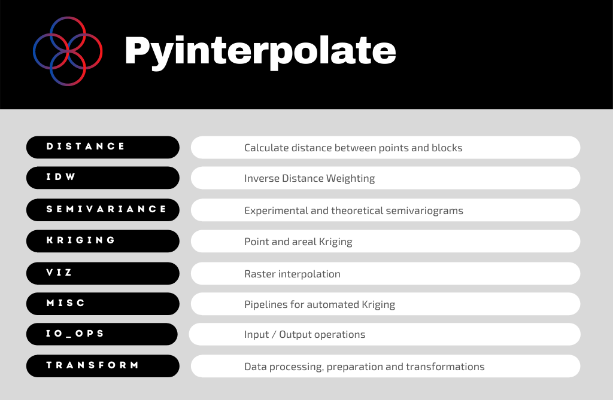

# Summary

We use spatial Interpolation techniques to interpolate values at unknown locations or filter and smooth existing data sources. Those methods work for point observations and areal aggregates. The basic idea behind this algorithms is that every point in space can be described as a function of its neighbors’ values weighted by the relative distance from the analyzed point. It is known as Tobler's First Law of Geography, which states: *everything is related to everything else, but near things are more related than distant things* [@Tobler:1970].

Kriging technique designed for mining applications exploits this statement formally, and nowadays, it has gained a lot of attention outside the initial area of interest. Today *Kriging* is a set of methods applied to problems from multiple fields: environmental science, hydrogeology, natural resources monitoring, remote sensing, epidemiology and ecology, and even computer science [@Chilès:2018]. Commonly Kriging is used to interpolate values from point measurements or regular block units. However, the real-world datasets are often different. Especially challenging are measurements of processes over areas, for example, administrative units in every country [@Goovaerts:2007].

**Pyinterpolate** transforms areas of irregular shapes and sizes with Area-to-Area and Area-to-Point Poisson Kriging functions. Those algorithms make **Pyinterpolate** beneficial for social, environmental, and public health scientists because they usually deal with areal counts instead of point measurements. Moreover, the package offers basic point Kriging and Inverse Distance Weighting techniques. Those algorithms are used in every field of research where geostatistical (distance) analysis gives meaningful results. **Pyinterpolate** merges basic Kriging techniques with more sophisticated Area-to-Area and Area-to-Point Poisson Kriging methods.

# Statement of need

**Pyinterpolate** is a Python package for spatial interpolation. It performs predictions from point measurements and areal aggregates of different sizes and shapes. Pyinterpolate automates Kriging interpolation and semivariogram regularization. The package helps with data exploration, data preprocessing and semivariogram analysis. A researcher with geostatistical background has control over the basic modeling parameters: semivariogram models, nugget, sill and range, the number of neighbors included in the interpolation and Kriging type. The thing that makes Pyinterpolate different from other spatial interpolation packages is the ability to perform Kriging on areas of different shapes and sizes. This type of operation is essential in social, medical and ecological sciences [@Goovaerts:2007; @Goovaerts:2008; @Kerry:2013].

## Importance of areal (block) Kriging

There are many applications where researchers need to model areal data with irregular shapes and sizes. A good example is the public health sector, where data is aggregated over administrative units for patient protection and policy-making purposes. Unfortunately, this transformation makes data analysis and modeling more complex for researchers. There are techniques to deal with this kind of data. We can work directly with areal aggregates or transform the irregular areal’s centroids support into the point-support model. The latter is not a way to *get back* original observations but rather a form of lossy semivariogram transformation to the point-support scale. There are reasons to do it:

1. The presence of extremely unreliable rates that typically occur for sparsely populated areas and rare events. Consider the examples with the number of leukemia cases (numerator) per population size in a given county (denominator) or the number of whales observed in a given area (numerator) per time of observation (denominator). In those cases, extreme values may be related to the fact that variance for a given area of interest is high (low number of samples) and not to the fact that the chance of the event is exceptionally high for this region.
2. The visual bias. People tend to give more importance to large blocks in contrary to the small regions.
3. The mismatch of spatial supports for aggregated data and other variables. Data for spatial modeling should have harmonized spatial scale and the same extent. The aggregated datasets are not an exception. It may lead to the trade-off where we must aggregate other variables to build a model. Unfortunately, we lost a lot of information in this case. The other problem is that administrative regions are artificial constructs and aggregation of variables may remove spatial trends from data. A downscaling of areal data into filtered population blocks may be better suited to risk estimation along with remote-sensed data or in-situ observations of correlated variables [@Goovaerts:2006].

In this context, Area-to-Area Poisson Kriging serves as the noise-filtering algorithm or areal interpolation model, and Area-to-Point Poisson Kriging interpolates and transforms values and preserves the prediction coherence (where the disaggregated estimates sum is equal to the baseline area value) [@Goovaerts:2008]. The chained-pipelines may utilize Area-to-Point Poisson Kriging, especially if scientist needs to change the support of variables. The author created a model of this type, the machine-learning pipeline with a model based on the remote-sensing data was merged with the geostatistical population-at-risk model derived from the Area-to-Point Poisson Kriging (the research outcomes are not published yet).

Alternatively to the Area-to-Area and Area-to-Point Poisson Kriging, researchers may use centroids and perform point kriging over a prepared regular point grid. However, this method has its pitfalls. Different sizes and shapes of the baseline units lead to the imbalanced number of variogram point pairs per lag. The centroid-based approach misses spatial variability of the linked variable, for example, population density over an area in the context of infection rates.

# Methodology

The chapter presents the general calculations methodology within a package. The document [here](https://github.com/SimonMolinsky/pyinterpolate-paper/blob/main/paper/supplementary%20materials/example_use_case.md) presents an example use-case. Then document [here](https://github.com/SimonMolinsky/pyinterpolate-paper/blob/main/paper/supplementary%20materials/comparison_to_gstat.md) is a comparison of the Ordinary Kriging algorithms between **gstat** package and **Pyinterpolate**.

## Spatial Interpolation with Kriging

Kriging is an estimation method that gives the best unbiased linear estimates of point values or block averages [@Armstrong:1998]. It is the core method of the **Pyinterpolate** package.
The primary technique is the Ordinary Kriging. The value at unknown location $\hat{z}$ is estimated as a linear combination of $K$ neighbors with the observed values $z$ and weights $\lambda$ assigned to those neighbors (1).

(1) $$\hat{z} = \sum_{i=1}^{K}\lambda_{i}z_{i}$$

Weights $\lambda$ are a solution of following system of linear equations (2):

(2) $$\sum_{j=1}^{K}\lambda_{j} C(x_{i}, x_{j}) - \mu = \bar{C}(x_{i}, V); i=1, 2, ..., K$$ $$\sum_{i}^{K}\lambda_{i} = 1$$

where $C(x_{i}, x_{j})$ is a covariance between points $x_{i}$ and $x_{j}$, $\bar{C}(x_{i}, V)$ is an average covariance between point $x_{i}$ and all other points in a group ($K$ points) and $\mu$ is the Lagrange multiplier. The same system may be solved with semivariance instead of covariance (3):

(3) $$\sum_{i=1}^{K}\lambda_{j} \gamma(x_{i}, x_{j}) + \mu = \bar{\gamma}(x_{i}, V); i=1, 2, ..., K$$ $$\sum_{i}^{K}\lambda_{i} = 1$$

where $\gamma(x_{i}, x_{j})$ is a semivariance between points $x_{i}$ and $x_{j}$, $\bar{\gamma}(x_{i}, V)$ is an average semivariance between point $x_{i}$ and all other points.
Semivariance is a key concept of spatial interpolation. It is a measure of dissimilarity between observations in a function of distance. Equation (4) is an experimental semivariogram estimation formula and $\gamma_{h}$ is an experimental semivariance at lag $h$:

(4) $$\gamma_{h} = \frac{1}{2N}\sum_{i}^{N}(z_{(x_{i} + h)} - z_{x_{i}})^{2}$$

where $z_{x_{i}}$ is a value at location $x_{i}$ and $z_{(x_{i} + h)}$ is a value at a translated location in a distance $h$ from $x_{i}$.

Pyinterpolate package implements linear, spherical, exponential and Gaussian models [@Armstrong:1998]. They are fitted to the experimental curve. The model with the lowest error is used in (3) to estimate the $\gamma$ parameter.

**Simple Kriging** is another method for point interpolation in **Pyinterpolate**. We may use Simple Kriging when we know the process mean. This situation rarely occurs in real-world scenarios. It is observed in places where sampling density is high [@Armstrong:1998]. Simple Kriging system is defined as:

(5) $$\hat{z} = R + \mu$$

where $\mu$ is a Lagrange multiplier and $R$ is a residual at a specific location. The residual value is derived as the first element (denoted as $\boldsymbol{1}$) from:

(6) $$R = ((Z - \mu) \times \lambda)\boldsymbol{1}$$

The number of values depends on the number of neighbors in a search radius, similar to equation (1) for Ordinary Kriging. The weights $\lambda$ are the solution of the following function:

(7) $$\lambda = K^{-1}(\hat{k})$$

The $K$ denotes a semivariance matrix between each neighbor of size $NxN$. The $k$ parameter is a semivariance between unknown (interpolated) location and known points of size $Nx1$.

Users may use three types of Poisson Kriging procedure: Centroid-based Poisson Kriging, Area-to-Area Poisson Kriging and Area-to-Point Poisson Kriging. Each defines the risk over areas (or points) similarly to the equation (1). However, the algorithm estimates the weights associated with the $\lambda$ parameter with additional constraints related to the population weighting. The spatial support of each unit needs to be accounted for in both the semivariogram inference and kriging. The procedure of Poisson Kriging interpolation of areal data is presented in [@Goovaerts:2006] and semivariogram deconvolution in [@Goovaerts:2007].

## Interpolation methods within Pyinterpolate

**Pyinterpolate** performs six types of spatial interpolation at the time of paper writing; five types of Kriging and inverse distance weighting:

1. **Ordinary Kriging**. It is a universal method for point interpolation.
2. **Simple Kriging** is a special case of point interpolation when the mean of the spatial process is known and does not vary spatially in a systematic way.
3. **Centroid-based Poisson Kriging**. is used for areal interpolation and filtering and assumes that each block can collapse into its centroid. It is much faster than Area-to-Area and Area-to-Point Poisson Kriging but introduces bias related to the area's transformation into single points.
4. **Area-to-Area Poisson Kriging** is used for areal interpolation and filtering. If point support varies over an area, it will appear in the analysis. The model can catch this variation.
5. **Area-to-Point Poisson Kriging**. Areal support is deconvoluted in regards to the point support. Output map has a spatial resolution of the point support while coherence of analysis is preserved (sum of rates is equal to the output of Area-to-Area Poisson Kriging). It is used for point-support interpolation and data filtering.

The user starts with semivariogram exploration and modeling. Next, the researcher or algorithm chooses the theoretical model which best fits the semivariogram. If this is done automatically, the algorithm tests linear, spherical and exponential models with different sills and ranges and the constant nugget against the experimental curve. Model performance is measured by the root mean squared error between the tested theoretical model with the experimental semivariance. 

Areal data interpolation, especially transformation from areal aggregates into point support maps, requires deconvolution of areal semivariogram. Users may do it without prior knowledge of kriging and spatial statistics because this operation is automated. The iterative procedure of the semivariogram regularization is described in detail in [@Goovaerts:2007]. The last step of analysis is a solution of linear Kriging equations.

Predicted data is stored as a DataFrame known from the **Pandas** and **GeoPandas** Python packages. Pyinterpolate allows the user to transform the point data into a regular Numpy array grid for further processing and analysis. Use case with the whole scenario is available in the [paper package repository](https://github.com/szymon-datalions/pyinterpolate-paper).

The package can automatically perform the semivariogram fitting step with a derivation of the theoretical semivariogram from the experimental curve. The semivariogram regularization is entirely automated (the process is described in [@Goovaerts:2007]). Users can change the derived theoretical model only by directly overwriting the derived semivariogram model parameters (nugget, sill, range, model type).

The initial field of study (epidemiology) was the reason behind the automation of the tasks related to semivariogram modeling. **Pyinterpolate** was initially developed for the epidemiological research, where areal aggregates of infections were transformed to point support population-at-risk maps. It is assumed that users without a broad geostatistical background may use **Pyinterpolate** for spatial data modeling and analysis, especially users observing processes related to the human population.

The \autoref{fig1} is an example of a full-scale process of the semivariogram regularization and Area-to-Point Poisson Kriging.

### Areal data transformation

To disaggregate areal data into the point support, one must know a regionalized variable’s point support covariance or semivariance. Then the semivariogram deconvolution is performed. In this iterative process, the experimental semivariogram of areal data is transformed to fit the semivariogram model of a linked point support variable. Journel and Huijbregts [@journel_huijbregts78] presented a general approach to deconvolute regularized semivariogram:

1. Define a point-support model from inspection of the semivariogram od areal data and estimate the parameters (sill and range) using basic deconvolution rules.
2. Compute the theoretically regularized model and compare it to the experimental curve.
3. Adjust the parameters of the point-support model to bring them in line with the regularized model.

**Pyinterpolate** follows an extended procedure. It leads to the automatic semivariogram regularization. [@Goovaerts2007] described this process in detail. The procedure has ten steps:

1. Compute the experimental semivariogram of areal data and fit a theoretical model to it.
2. The algorithm compares a few theoretical models and calculates the error between a modeled curve and the experimental semivariogram. The algorithm selects the theoretical model with the lowest error as the initial point-support model.
3. The initial point-support model is regularized according to the procedure given in [@Goovaerts2007].
4. Quantify the deviation between the initial point-support model and the theoretically regularized model.
5. The initial point-support model, the regularized model and the associated deviation are considered optimal at this stage.
6. Iterative process begins: for each lag, the algorithm calculates the experimental values for the new point-support semivariogram. Those values are computed through a rescaling of the optimal point support model available at this stage.
7. The rescaled values are fitted to the new theoretical model in the same procedure as the second step.
8. The new theoretical model (from step 7.) is regularized.
9. Compute the difference statistic for the new regularized model (step 8.). Decide what to do next based on the value of the new difference statistic. If it is smaller than the optimal difference statistic, use the point support model (step 7.) and the associated statistic as the optimal point-support model and the optimal difference statistic. Repeat steps from 6. to 8. If the difference statistic is larger or equal to the optimal difference statistic, repeat steps 6 through 8 with a change of the rescaling weights.
10. Stop the procedure after i-th iteration whenever one of the specified criteria are met: (1) the difference statistic reaches a sufficiently small value, (2) the maximum number of iterations has been tried, (3) a small decrease in the difference statistic was recorded a given number of times.

## Modules

Pyinterpolate has seven modules covering all operations needed to perform spatial interpolation: input/output operations, data processing, transformation, semivariogram fitting, Kriging interpolation. \autoref{fig2} shows the internal package structure.

Modules follow typical data processing and modeling steps. The first module is **io_ops** which reads point data from text files and areal or point data from shapefiles, then changes data structure for further processing. **Transform** module is responsible for all tasks related to changes in data structure during program execution. Sample tasks are:

- finding centroids of areal data,
- building masks of points within lag.

Functions for distance calculation between points and between areas (blocks) are grouped within the **distance** module. **Pyinterpolate** most complex module is the **Semivariance**. It has three special classes for the calculation and storage of different types of semivariograms and other functions important for spatial analysis:

- experimental semivariance / covariance calculation,
- weighted semivariance estimation,
- variogram cloud preparation,
- outliers removal.

**Kriging** module contains Ordinary Kriging, Simple Kriging, Centroid-based Poisson Kriging, Area-to-Area Poisson Kriging and Area-to-Point Poisson Kriging algorithms. Areal models are derived from [@Goovaerts:2008], Simple Kriging and Ordinary Kriging models are based on [@Armstrong:1998].

It is possible to show output as a **NumPy** array with **viz** module and compare multiple Kriging models trained on the same dataset with the **misc** module. The evaluation metric for comparison is the average root mean squared error over multiple random divisions of a passed dataset (cross-validation).

# Comparison to Existing Software

**Pyinterpolate** is a package from an ecosystem of spatial modeling and spatial interpolation packages written in Python. The main difference between **Pyinterpolate** and other packages is that it focuses on areal deconvolution methods and Poisson Kriging techniques useful for ecology, social science and public health studies. Potential users may choose other packages if they can perform their research with the point data interpolation.

The most similar and significant package from the Python environment is **PyKrige** [@benjamin_murphy_2020_3991907]. PyKrige is designed especially for point kriging. PyKrige supports 2D and 3D ordinary and universal Kriging. User can incorporate own semivariogram models and use external functions (as an example from **scikit-learn** package [@scikit-learn]) to model drift in universal Kriging. The package is well designed, and it is actively maintained.

**GRASS GIS** [@GRASS_GIS_software] is well-established software for vector and raster data processing and analysis. GRASS contains multiple modules and a user may access them in numerous ways: GUI, command line, C API, Python APU, Jupyter Notebooks, web, QGIS or R. GRASS has two functions for spatial interpolation: `r.surf.idw` and `v.surf.idw`. Both use Inverse Distance Weighting technique, first interpolated raster files and second vectors (points).

**PySAL** is the next GIS / geospatial package that is used for spatial interpolation. However, **PySAL** is built upon the spatial graph analysis algorithms. Package’s (sub-module) for areal analysis is **tobler** [@eli_knaap_2020_4385980]. Moreover, the package has functions for multisource regression, where raster data is used as auxiliary information to enhance interpolation results.

**R programming language** offers **gstat** package for spatial interpolation and spatial modeling [@PEBESMA2004683]. The package is designed for variogram modeling, simple, ordinary and universal point or block kriging (with drift), spatio-temporal kriging and sequential Gaussian (co)simulation. Gstat is a solid Kriging and spatial interpolation package and has the largest number of methods to perform spatial modeling. The main difference between **gstat** and **Pyinterpolate** is the availability of area-to-point Poisson Kriging in the latter and the difference between baseline programming languages [@Goovaerts:2007]. The functional comparison to **gstat** is available in the [paper repository](https://github.com/SimonMolinsky/pyinterpolate-paper).

# Appendix\label{appendix}

1. [**Paper repository** with additional materials](https://github.com/SimonMolinsky/pyinterpolate-paper)
2. [**Package repository**](https://github.com/DataverseLabs/pyinterpolate)
3. [**Automatic fit of semivariogram within the package**](https://pyinterpolate.readthedocs.io/en/latest/algorithms_documentation/Automatic%20Fitting%20of%20the%20Semivariogram%20Model.html)
4. [**Outliers Detection within the package**](https://pyinterpolate.readthedocs.io/en/latest/algorithms_documentation/Outliers%20Removal.html)

# References

