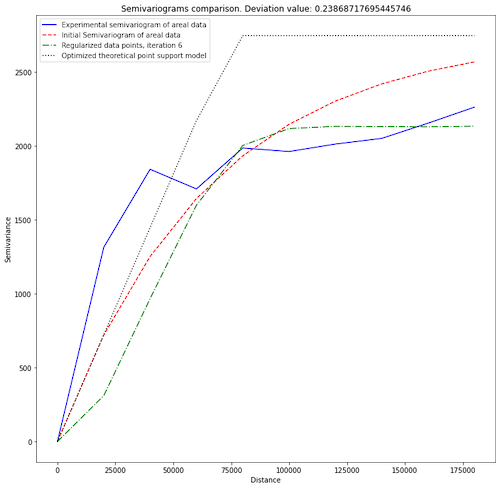
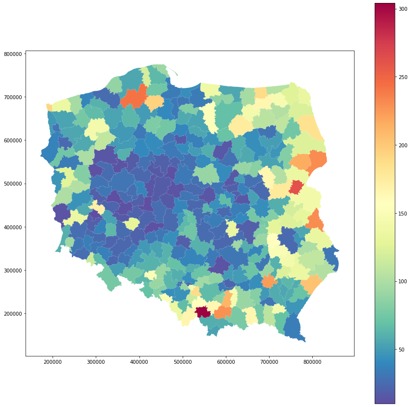
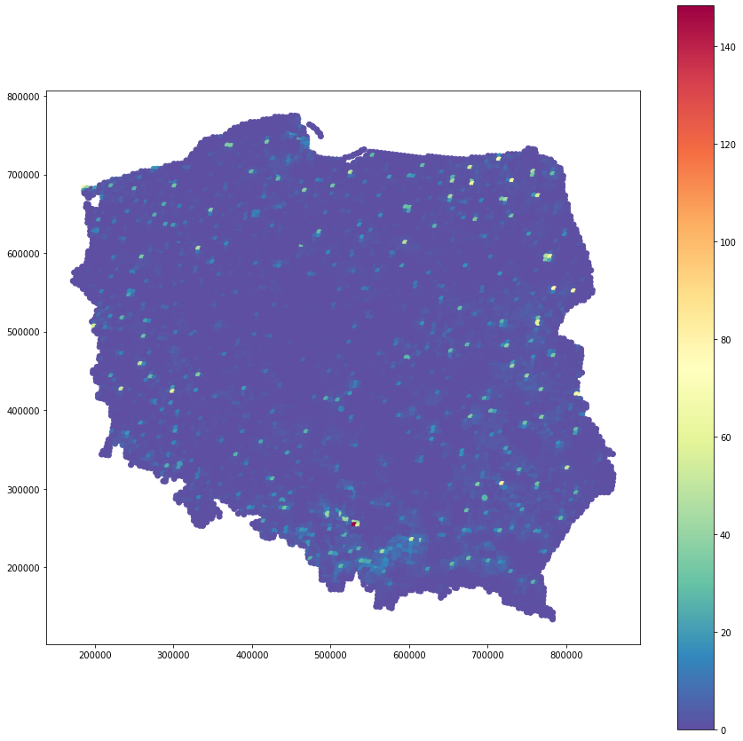

# Summary

Spatial Interpolation techniques are used to retrieve spatially corellated data at unknown locations from point observations and/or areal aggregates. The basic idea is that measurement at one location is a function of weighted distance between this place and its neighbors. It is known as the Tobler's First Law of Geography, which states: *everything is related to everything else, but near things are more related than distant things* [@Tobler:1970]. Important method of spatial interpolation is Kriging, which initially was designed for mining applications and point-support predictions. Today this technique is much more complex and it can be applied to problems of environmental science, hydrogeology, natural resources and mining, remote sensing and epidemiology [@Chilès:2018]. Kriging may be performed not only with point observations but with areal aggregates too.

# Statement of need

Pyinterpolate is a Python package for spatial interpolation and it is designed to perform predictions from point clouds and areal aggregates of different sizes and shapes. Pyinterpolate automates tasks performed by spatial statisticians, it helps with data exploration, semivariogram estimation and kriging predictions. It allows researches to perform semivariogram deconvolution in presence of irregular administrative units and Poisson Kriging of counts data which is widely used in the public sciences, epidemiology and spatial statistics [@Goovaerts:2007].

Package performs five types of spatial interpolation: Ordinary Kriging and Simple Kriging (point data), Centroid-based Poisson Kriging, Area-to-Area Poisson Kriging and Area-to-Point Poisson Kriging (areal data). Techniques for point data analysis require manual or automatic semivariogram fitting to predict missing values. Areal analysis is automatic due to the fact, that this kind of study is most interesting for researchers from public and environmental sciences without computer science and geostatics background. Package was developed for epidemiology study, where areal aggregates of infections were transformed to point support population-at-risk maps and multiple potential applications follow this algorithm.

# Spatial Interpolation

Kriging, which is baseline of the Pyinterpolate package, is an estimation method that gives the best unbiased linear estimates of point values or block averages [@Armstrong:1998]. Kriging minimizes variance of a dataset with missing values. Baseline technique is the Ordinary Kriging where value at unknown location $\hat{z}$ is estimated as a linear combination of $K$ neighbors with value $z$ and weights $\lambda$ assigned to those neighbors (1).

(1)
$$\hat{z} = \sum_{i=1}^{K}\lambda_{i}*z_{i}$$

Weights $\lambda$ are a solution of following system of linear equations (2):

(2)
$$\sum_{j=1}\lambda_{j} C(x_{i}, x_{j}) - \mu = \bar{C}(x_{i}, V); i=1, 2, ..., K$$
$$\sum_{i}\lambda_{i} = 1$$

where $C(x_{i}, x_{j})$ is a covariance between points $x_{i}$ and $x_{j}$, $\bar{C}(x_{i}, V)$ is an average covariance between point $x_{i}$ and all other points in a group ($K$ points) and $\mu$ is a process mean. The same system may be solved with **semivariance** instead of **covariance** (3):

(3)
$$\sum_{j=1}\lambda_{j} \gamma(x_{i}, x_{j}) + \mu = \bar{\gamma}(x_{i}, V); i=1, 2, ..., K$$
$$\sum_{i}\lambda_{i} = 1$$

where $\gamma(x_{i}, x_{j})$ is a semivariance between points $x_{i}$ and $x_{j}$, $\bar{\gamma}(x_{i}, V)$ is an average semivariance between point $x_{i}$ and all other points.

Semivariance is a key concept for spatial interpolation. It is a measure of dissimilarity between observations in a function of distance. Equation (4) is a semivariance estimation formula and \autoref{fig1} shows realization of experimental semivariogram (blue curve in \autoref{fig1}).

(4)
$$\frac{1}{2N}\sum_{i}^{N}(z_{(x_{i} + h)} - z_{x_{i}})^{2}$$

where $z_{x_{i}}$ is a value at location $x_{i}$ and $z_{(x_{i} + h)}$ is a value at translated location in a distance $h$ from $x_{i}$.

After estimation of experimental semivariogram theoretical models are fitted to the experimental curve and this with the lowest error is used as a model semivariance in (3). There are few basic types of semivariogram models: linear, spherical, exponential and gaussian. \autoref{fig1} shows semivariogram models fitted to the experimental curves and those are initial semivariogram of areal data (red curve) and optimized theoretical point support model (black dotted curve).

Prediction steps in spatial interpolation are generally the same for point and areal datasets. User should perform semivariogram analysis, e.g: analysis of semivariance in the function of a distance. Then researcher or algorithm chooses theoretical model which best fits semivariogram. This model is used to predict values at unknown locations. Areal data interpolation, especially transformation from areal aggregates into point support maps, requires deconvolution of areal semivariogram (\autoref{fig1} shows outputs of this process). This is automatic process which can be performed without prior knowledge of kriging and spatial statistics. The last step is Kriging itself. Poisson Kriging is especially useful for counts over areas. On the other spectrum is Ordinary Kriging which is an universal technique which works well with multiple point data sources. Predicted data is stored as a dataframe. Pyinterpolate allows users to transform given point data into regular numpy array grid for visualization purposes and to perform large-scale comparison of different kriging techniques prediction output.

\autoref{fig2} and \autoref{fig3} show one realization of choropleth map for epidemiological study before and after regularization and Area-to-Point Poisson Kriging transformation where we get rid of a visual bias.

# References
