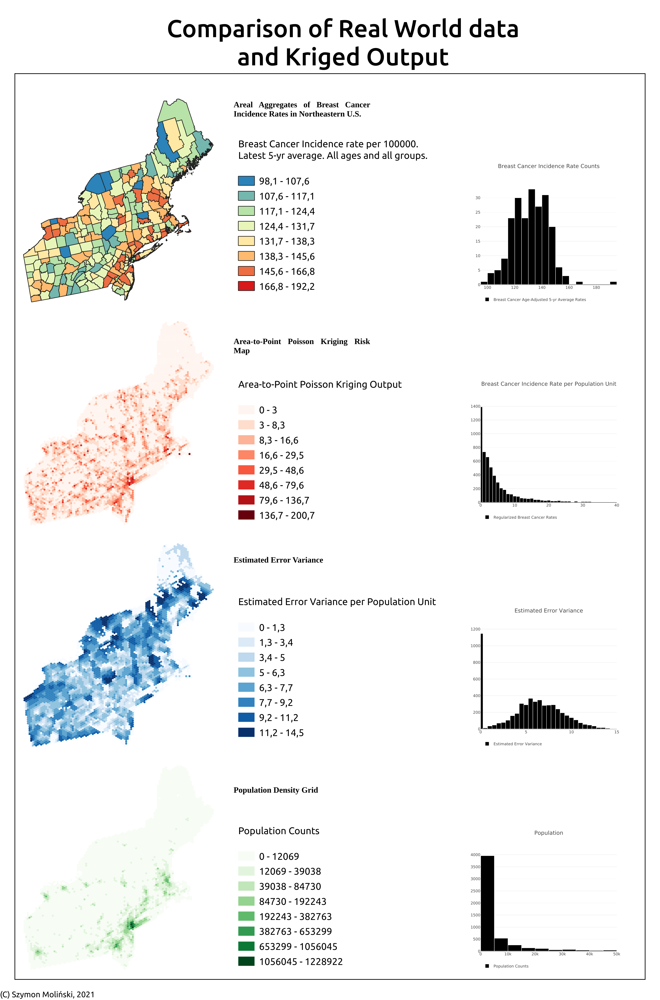
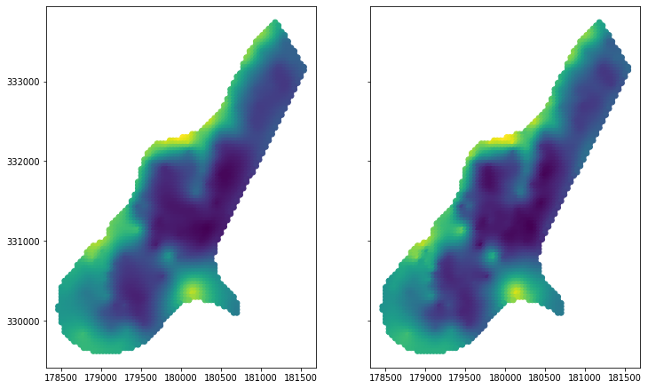

# Summary

Spatial Interpolation techniques are used to retrieve data at unknown locations from point observations and/or areal aggregates. The basic idea is that measurement at one location is a function of weighted distance between this place and its neighbors. It is known as the Tobler's First Law of Geography, which states: *everything is related to everything else, but near things are more related than distant things* [@Tobler:1970]. Important method of spatial interpolation is Kriging, which initially was designed for mining applications. Today this technique is much more complex, and it can be applied to problems of environmental science, hydrogeology, natural resources monitoring, remote sensing and epidemiology [@Chilès:2018]. Kriging is usually applied to point measurements and regular blocks, but nowdays it could be used with areal data of irregular shapes and sizes too [@Goovaerts:2007].

# Statement of need

Pyinterpolate is a Python package for spatial interpolation and it is designed to perform predictions from point measurements and areal aggregates of different sizes and shapes. Pyinterpolate automates tasks performed by spatial statisticians, it helps with data exploration, semivariogram estimation and kriging predictions. It allows researchers to perform semivariogram deconvolution in presence of irregular administrative units and to apply Poisson Kriging to areal counts. This type of Kriging is widely used in the social sciences, epidemiology and spatial statistics [@Goovaerts:2007; @Goovaerts:2008; @Kerry:2013].

Package performs five types of spatial interpolation: Ordinary Kriging and Simple Kriging (point data), Centroid-based Poisson Kriging, Area-to-Area Poisson Kriging and Area-to-Point Poisson Kriging (areal data). Techniques for point data analysis require manual or automatic semivariogram fitting to predict missing values. Areal analysis requires additional step of semivariogram deconvolution and/or areal centroids calculation, but package performs those steps automatically. User has options to control prediction flow. Package was initially developed for epidemiological study, where areal aggregates of infections were transformed to point support population-at-risk maps and multiple potential applications follow this algorithm. This is the reason behind automation of many tasks related to the data modeling. It is assumed that user without wide geostatistical background may use Pyinterpolate for modeling and analysis.

## Other packages for spatial interpolation

PyInterpolate is one package from large ecosystem of spatial modeling and spatial interpolation packages written in Python. The main difference between Pyinterpolate and other packages is focus on areal deconvolution methods and Poisson Kriging techniques useful for ecology, social science and public health studies. Potential users may choose other packages if their study is limited to point data interpolation.

The most similar and most important package is **PyKrige** [@benjamin_murphy_2020_3991907]. PyKrige is designed especially for point kriging. PyKrige supports 2D and 3D ordinary and universal Kriging. User is able to incorporate own semivariogram models and/or use external functions (as example from **scikit-learn** package [@scikit-learn]) to model drift in universal Kriging. Package is well designed, and it is actively maintained. PyKrige is written in Python.

**GRASS GIS** [@GRASS_GIS_software] is well-established software for vector and raster data processing and analysis. GRASS contains multiple modules and GRASS functionalities can be accessed from multiple interfaces: GUI, command line, C API, Python APU, Jupyter Notebooks, web, QGIS and R. GRASS has two functions for spatial interpolation: r.surf.idw and v.surf.idw. Both use Inverse Distance Weighting technique, first interpolates raster files and second vectors (points).

**PySAL** is next GIS / geospatial package which can be used to interpolate missing values – but this time at areal scale. Package’s **tobler** module can be used to interpolate areal values of specific variable at different scales and sizes of support [@eli_knaap_2020_4385980]. Moreover, package has functions for multisource regression, where raster data is used as auxiliary information to enhance interpolation results. Conceptually tobler package is close to the pyinterpolate, where main algorithm transforms areal data into point support derived from auxiliary variable.

**R programming language** offers **gstat** package for spatial interpolation and spatial modeling [@PEBESMA2004683]. Package is designed for variogram modelling, simple, ordinary and universal point or block kriging (with drift), spatio-temporal kriging and sequential Gaussian (co)simulation. Gstat is a solid package for Kriging and spatial interpolation and has the largest number of methods to perform spatial modelling. The main difference between gstat and pyinterpolate is availability of area-to-point Poisson Kriging based on the algorithm proposed by Goovaerts [bibliografia] in the latter.


# Spatial Interpolation

Kriging, which is baseline of the Pyinterpolate package, is an estimation method that gives the best unbiased linear estimates of point values or block averages [@Armstrong:1998]. Kriging minimizes variance of a dataset with missing values. Baseline technique is the Ordinary Kriging where value at unknown location $\hat{z}$ is estimated as a linear combination of $K$ neighbors with value $z$ and weights $\lambda$ assigned to those neighbors (1).

(1)
$$\hat{z} = \sum_{i=1}^{K}\lambda_{i}*z_{i}$$

Weights $\lambda$ are a solution of following system of linear equations (2):

(2)
$$\sum_{j=1}\lambda_{j} C(x_{i}, x_{j}) - \mu = \bar{C}(x_{i}, V); i=1, 2, ..., K$$
$$\sum_{i}\lambda_{i} = 1$$

where $C(x_{i}, x_{j})$ is a covariance between points $x_{i}$ and $x_{j}$, $\bar{C}(x_{i}, V)$ is an average covariance between point $x_{i}$ and all other points in a group ($K$ points) and $\mu$ is a process mean. The same system may be solved with **semivariance** instead of **covariance** (3):

(3)
$$\sum_{j=1}\lambda_{j} \gamma(x_{i}, x_{j}) + \mu = \bar{\gamma}(x_{i}, V); i=1, 2, ..., K$$
$$\sum_{i}\lambda_{i} = 1$$

where $\gamma(x_{i}, x_{j})$ is a semivariance between points $x_{i}$ and $x_{j}$, $\bar{\gamma}(x_{i}, V)$ is an average semivariance between point $x_{i}$ and all other points.

Semivariance is a key concept of spatial interpolation. It is a measure of a dissimilarity between observations in a function of distance. Equation (4) is a semivariance estimation formula and \autoref{fig1} shows realization of experimental semivariogram (blue curve in \autoref{fig1}).

(4)
$$\frac{1}{2N}\sum_{i}^{N}(z_{(x_{i} + h)} - z_{x_{i}})^{2}$$

where $z_{x_{i}}$ is a value at location $x_{i}$ and $z_{(x_{i} + h)}$ is a value at translated location in a distance $h$ from $x_{i}$.

After estimation of experimental semivariogram theoretical models are fitted to the experimental curve and this with the lowest error is used as a model semivariance in (3). There are few basic types of semivariogram models: linear, spherical, exponential and gaussian. \autoref{fig7} shows semivariogram models fitted to the experimental curves and those are initial semivariogram of areal data (red curve) and optimized theoretical point support model (black dotted curve).

Prediction steps in spatial interpolation are generally the same for point and areal datasets. User should perform semivariogram analysis, e.g: analysis of semivariance in the function of a distance. Then researcher or algorithm chooses theoretical model which best fits semivariogram. This model is used to predict values at unknown locations. Areal data interpolation, especially transformation from areal aggregates into point support maps, requires deconvolution of areal semivariogram (\autoref{fig7} shows outputs of this process). This is automatic process which can be performed without prior knowledge of kriging and spatial statistics. The last step is Kriging itself. Poisson Kriging is especially useful for counts over areas. On the other spectrum is Ordinary Kriging which is an universal technique which works well with multiple point data sources. Predicted data is stored as a _DataFrame_ known from the Pandas and GeoPandas Python packages. Pyinterpolate allows users to transform given point data into regular numpy array grid for visualization purposes and to perform large-scale comparison of different kriging techniques prediction output.

\autoref{fig8} and \autoref{fig9} show one realization of choropleth map for epidemiological study before and after regularization and Area-to-Point Poisson Kriging transformation where we get rid of a visual bias.

# Structure of package


# Example use case: Breast Cancer Rate in Pennsylvania State

Package logic follows typical pipeline:

1. Read and prepare data.
2. Analyze and test semivariance of points or areas.
3. Create theoretical semivariogram or regularize one.
4. Build Kriging model.
5. Predict.

We go through it point by point to demonstrate package capabilities. Breast cancer rates are taken from Incidence Rate Report for Pennsylvania by County [@cancerData]. These are rates of all stages of a breast cancer in all races and all ages, mean for 2013-2017, Age-adjusted rates multiplied by 100,000. These rates are merged with Pennsylvania counties shapefile downloaded from the Pennsylvania Spatial Data Access portal [@pennSpatial]. Population centroids are retrived from the Centers of Population for the 2010 Census Blocks  [@popCensus]. Breast cancer affects only females but for this example we include whole population for an area. Raw and transformed datasets are available in dedicated Github repository [@paperRepo].

Our work is to perform Area-to-Point Poisson Kriging on this dataset and transform areal aggregates into population-specific blocks (points). This process requires two main steps: **semivariogram regularization** and **Poisson Kriging**. Those two steps are divided into five smaller steps.

1. Read and prepare data.

```python
import numpy as np
import pandas as pd
import geopandas as gpd

from pyinterpolate.io_ops import prepare_areal_shapefile, get_points_within_area  # Prepare data
from pyinterpolate.semivariance import calculate_semivariance  # Experimental semivariogram
from pyinterpolate.semivariance import RegularizedSemivariogram  # Semivariogram regularization class
from pyinterpolate.semivariance import TheoreticalSemivariogram
from pyinterpolate.kriging import ArealKriging

import matplotlib.pyplot as plt


areal_data = 'breast_cancer_data.shp'
point_data = 'population_blocks.shp'

areal_id = 'id'
areal_val = 'rate'
points_val = 'POPULATION'

areal_data_prepared = prepare_areal_shapefile(areal_data, areal_id, areal_val)

points_in_area = get_points_within_area(areal_data, point_data, areal_id_col_name=areal_id, points_val_col_name=points_val)

```

**Pyinterpolate** has own data structures and ```areal_data_prepared``` variable is an array:

```python
array(
	[areal_id,
	<shapely.geometry.polygon.Polygon>,
	centroid longitude,
	centroid latitude,
	rate value],
dtype=object)
```

and ```points_in_area``` is another array:

```python
array(
	[value, array([
       		[ longitude 0,   latitude 0, value 0   ],
       		[ longitude ...,   latitude ..., value ... ],
       		[ longitude n,   latitude n, value n    ]
       ])],
dtype=object)
```

2. Analyze and test semivariance of points or areas.

Before Kriging we must create semivariogram model of our data. In the case of areal data we must check semivariance of areal centroids \autoref{fig4} and we should check semivariance of point support \autoref{fig5} to be sure that process is spatially correlated at every level.

```python
maximum_range = 3.5
step_size = 0.1

dt = areal_data_prepared[:, 2:]  # x, y, val
exp_semivar = calculate_semivariance(data=dt, step_size=step_size, max_range=maximum_range)

# Plot experimental semivariogram

plt.figure(figsize=(12, 12))
plt.plot(exp_semivar[:, 0], exp_semivar[:, 1])
plt.title('Experimental semivariogram od areal centroids')
plt.xlabel('Range - in degrees')
plt.ylabel('Semivariance')
plt.show()
```


```python
def build_point_array(points):
    a = None

    for rec in points:
        if a is None:
            a = rec.copy()
        else:
            a = np.vstack((a, rec))

    return a

maximum_point_range = 3.5
step_size_points = 0.05


pt = build_point_array(points_in_area[:, 1])  # x, y, val
exp_semivar = calculate_semivariance(data=pt, step_size=step_size_points, max_range=maximum_point_range)

# Plot experimental semivariogram

plt.figure(figsize=(12, 12))
plt.plot(exp_semivar[:, 0], exp_semivar[:, 1])
plt.title('Experimental semivariogram od population data')
plt.xlabel('Range - in degrees')
plt.ylabel('Semivariance')
plt.show()
```


Both semivariograms shows spatial correlation in a dataset and both may be modeled with theoretical functions. We can go to the next step.

3. Create theoretical semivariogram or regularize one.

Semivariogram modeling is fully automated and best model is selected based on the lowest error between chosen model type (*spherical*, *linear*, *gaussian* or *exponential*) and experimental semivariogram. More complex is deconvolution of areal semivariogram described in [@Goovaerts:2007] which is performed in this example. Semivariogram deconvolution is a two-step process. In a first step of regularization all types of semivariograms are prepared for processing. In second step areal semivariogram is regularized in an interatve procedure, which is a time consuming process, which directly depends on the number of points of the support. Whole process could be enclosed in one procedure but due to the time required for procedure it is better to separate initial prepration and iterative regularization steps. We can check experimental semivariogram and theoretical model of areal data along with first output of regularization to be sure that our process can be modeled with spatial correlation analysis. \autoref{fig6} presents initial (baseline) semivariograms and \autoref{fig7} shows those after regularization. After procedure we are able to export model for the Kriging procedure.

```python
reg_mod = RegularizedSemivariogram()

reg_mod.fit(areal_data=areal_data_prepared,
            areal_step_size=step_size,
            max_areal_range=maximum_range,
            point_support_data=points_in_area,
            ranges=16,
            weighted_lags=True,
            store_models=False)

# Check initial experimental, theoretical and regularized semivariograms

lags = reg_mod.experimental_semivariogram_of_areal_data[:, 0]
plt.figure(figsize=(12, 12))
plt.plot(lags, reg_mod.experimental_semivariogram_of_areal_data[:, 1], color='b')
plt.plot(lags, reg_mod.initial_theoretical_model_of_areal_data.predict(lags), color='r', linestyle='--')
plt.plot(lags, reg_mod.initial_regularized_model, color='black', linestyle='dotted')
plt.legend(['Experimental semivariogram of areal data', 'Initial Semivariogram of areal data',
            'Regularized data points'])
plt.title('Semivariograms comparison. Deviation value: {}'.format(reg_mod.initial_deviation))
plt.xlabel('Distance')
plt.ylabel('Semivariance')
plt.show()
```


```python
reg_mod.transform(max_iters=15)
reg_mod.show_semivariograms()
```



```python
reg_mod.export_regularized_model('regularized_model.csv')
```

4. Build Kriging model.

With theoretical semivariogram we are able to model data with Kriging. In this example we create Poisson Kriging model to estimate population at risk at level of population centroids [@popCensus]. Map of Breast Cancer rates and population centroids shows that there are clusters of points but we leave them without declustering and perform analysis on this dataset \autoref{fig8}.


Area to point Poisson Kriging requires us to know semivariogram model and to assign number of closest neighbors and max radius of neighbors search.

```python
semivariogram = TheoreticalSemivariogram()  # Create TheoreticalSemivariogram object
semivariogram.import_model('regularized_model.csv')  # Load regularized semivariogram

number_of_obs = 8
radius = 1

# Get crs

gdf_crs = gpd.read_file(areal_data_file).crs

kriging_model = ArealKriging(semivariogram_model=semivariogram,
    known_areas=areal_data,
    known_areas_points=point_data,
    kriging_type='atp')

smoothed_area = kriging_model.regularize_data(number_of_neighbours=number_of_obs,
                                             max_search_radius=radius,
                                             data_crs=gdf_crs)
```

Whole process may take a while, especially if we have many support points. Method ```regularize_data()``` returns *GeoDataFrame* object with ```[id, geometry, estimated value, estimated prediction error, rmse]``` columns. We may plot output with *matplotlib* and check **population at risk** map \autoref{fig9}. Finally, point support map may be saved as a shapefile.

```python
smoothed_area.plot(column='estimated value', cmap='Spectral_r', legend=True, figsize=fs)

smoothed_area.to_file('smoothed_output.shp')
```




# References