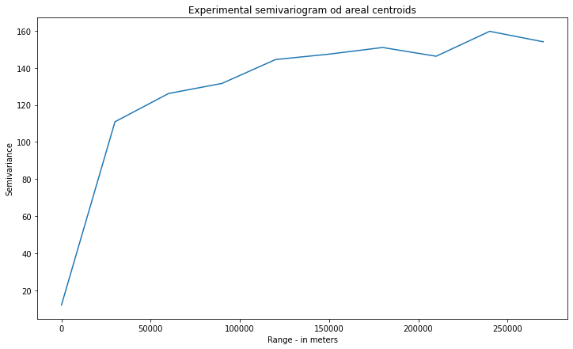

# Summary

Spatial Interpolation techniques are used to interpolate values at unknown locations and/or filter and smooth existing data sources. Those methods work for point observations and areal aggregates. The basic idea is that measurement at one location is a function of weighted distance between this place and its neighbors. It is known as the Tobler's First Law of Geography, which states: *everything is related to everything else, but near things are more related than distant things* [@Tobler:1970]. Kriging technique designed for mining applications exploits this statement formally and nowadays it has gained a lot of attention outside the initial area of interest. Today "kriging" is rather a set of methods which can be applied to environmental science, hydrogeology, natural resources monitoring, remote sensing, epidemiology and ecology problems [@Chilès:2018]. Kriging is usually used with point measurements or regular block units but many real-world datasets are different. Especially challenging are measurements of rates over areas of irregular shapes and sizes, as example administrative units in every country [@Goovaerts:2007]. Pyinterpolate is designed to tackle this problem and to simplify area variogram regularization. This property makes Pyinterpolate an interpolation and filtering tool for social, environmental and public health sciences. Package merges basic Kriging techniques with more sophisticated Area-to-Area and Area-to-Point Poisson Kriging methods.

# Statement of need

Pyinterpolate is a Python package for spatial interpolation and it is designed to perform predictions from point measurements and areal aggregates of different sizes and shapes. Pyinterpolate automates tasks performed by spatial statisticians, it helps with data exploration, semivariogram estimation and kriging predictions. Thing that makes Pyinterpolate different from other spatial interpolation packages is the ability to perform Kriging of areas of different shapes and sizes and this type of operation is extremely important in the context of social, medical and ecological sciences.

## Why is areal interpolation important?

Areas of irregular shapes and sizes are especially challenging for analysis and modeling. The ability to transform areal aggregates into point support is desired by many applications. As an example in public health studies data is aggregated over large areas due to the protection of citizens' privacy but this process introduces bias to modeling and makes policy-making more complex. The main three reasons behind transformation of choropleth maps with aggregated counts into point support models are:

1. The presence of extreme unreliable rates that typically occur for sparsely populated areas and rare events.
2. The visual bias resulting from aggregation of data over administrative units with various shapes and sizes.
3. The mismatch of spatial supports for aggregated data and explanatory variables. This prevents their direct use in models based on the correlation [@Goovaerts:2006].

In this context Area-to-Area Poisson Kriging serves as the noise-filtering algorithm or areal interpolation model and Area-to-Point Poisson Kriging is designed to interpolate and transform values and to preserve coherence of the prediction so the sum of average of disaggregated estimates is equal to the baseline area value [@Goovaerts:2008]. Area-to-Point Poisson Kriging can be useful in the chained-models systems where change of support is required to perform a study.

Researchers  may use centroids of areas and perform point kriging over a prepared regular point grid. However this method has pitfalls. Different sizes and shapes of units may lead to imbalanced variogram point pairs per lag. Centroid-based approach does not catch spatial variability of the linked variable, as example population density over area in the context of infection rates.

The goal is to transform areal semivariogram and then perform interpolation. To disaggregate areal data into point support one must know point support covariance and/or semivariance of a regionalized variable. Then the semivariogram deconvolution is performed. In this iterative process experimental semivariogram of areal data is transformed to fit the semivariogram model of a linked point support variable. Example of it is the use of spatial distribution of population to transform semivariogram of disease rates which are the number of cases divided by population. Semivariogram deconvolution is the core step of the Area-to-Area and Area-to-Point Poisson Kriging operations. Poisson Kriging is widely used in the social sciences, epidemiology and spatial statistics [@Goovaerts:2007; @Goovaerts:2008; @Kerry:2013].

## Interpolation methods within Pyinterpolate

Package performs five types of spatial interpolation:

1. Ordinary Kriging of points,
2. Simple Kriging of points,
3. Centroid-based Poisson Kriging of areas,
4. Area-to-Area Poisson Kriging of areas,
5. Area-to-Point Poisson Kriging of areas.

Point observation analysis requires manual or automatic semivariogram fitting to predict missing values. Areal analysis requires additional steps of semivariogram deconvolution and/or areal centroids calculation. Package performs those steps automatically. Users have options to control prediction flow. Package was initially developed for epidemiological study, where areal aggregates of infections were transformed to point support population-at-risk maps and multiple potential applications follow this algorithm. Initial field of study (epidemiology) was the reason behind automation of many tasks related to the data modeling. It is assumed that users without wide geostatistical background may use Pyinterpolate for spatial data modeling and analysis, especially users which are observing processes related to the human population.

# Spatial Interpolation with Kriging

Kriging, which is the baseline of the Pyinterpolate package, is an estimation method that gives the best unbiased linear estimates of point values or block averages [@Armstrong:1998]. Kriging minimizes variance of a dataset with missing values. Baseline technique is the **Ordinary Kriging** where value at unknown location $\hat{z}$ is estimated as a linear combination of $K$ neighbors with value $z$ and weights $\lambda$ assigned to those neighbors (1).

(1) $$\hat{z} = \sum_{i=1}^{K}\lambda_{i}z_{i}$$

Weights $\lambda$ are a solution of following system of linear equations (2):

(2) $$\sum_{j=1}\lambda_{j} C(x_{i}, x_{j}) - \mu = \bar{C}(x_{i}, V); i=1, 2, ..., K$$ $$\sum_{i}\lambda_{i} = 1$$

where $C(x_{i}, x_{j})$ is a covariance between points $x_{i}$ and $x_{j}$, $\bar{C}(x_{i}, V)$ is an average covariance between point $x_{i}$ and all other points in a group ($K$ points) and $\mu$ is a process mean. The same system may be solved with semivariance instead of covariance (3):

(3) $$\sum_{j=1}\lambda_{j} \gamma(x_{i}, x_{j}) + \mu = \bar{\gamma}(x_{i}, V); i=1, 2, ..., K$$ $$\sum_{i}\lambda_{i} = 1$$

where $\gamma(x_{i}, x_{j})$ is a semivariance between points $x_{i}$ and $x_{j}$, $\bar{\gamma}(x_{i}, V)$ is an average semivariance between point $x_{i}$ and all other points.
Semivariance is a key concept of spatial interpolation. It is a measure of a dissimilarity between observations in a function of distance. Equation (4) is a semivariance estimation formula and \autoref{fig2} and \autoref{fig3} show realization of experimental semivariogram.

(4) $$\frac{1}{2N}\sum_{i}^{N}(z_{(x_{i} + h)} - z_{x_{i}})^{2}$$

where $z_{x_{i}}$ is a value at location $x_{i}$ and $z_{(x_{i} + h)}$ is a value at translated location in a distance $h$ from $x_{i}$.

In the next step theoretical models are fitted to the experimental curve. Pyinterpolate package implements linear, spherical, exponential and gaussian models but many others are applied for specific cases [@Armstrong:1998]. Model with the lowest error is used in (3) to estimate $\gamma$ parameter.

Ordinary Kriging is one of the classic Kriging types within the package. **Simple Kriging** is another available method for point interpolation. Simple Kriging may be used when the process mean is known over the whole sampling area. This situation rarely occurs in real world. It can be observed in places where sampling density is high [@Armstrong:1998]. Simple Kriging system is defined as:

(5) $$\hat{z} = R + \mu$$

where $\mu$ is a process mean and $R$ is a residual at a specific location. Residual value is derived as the first element (denoted as $\boldsymbol{1}$) from:

(6) $$R = ((Z - \mu) \times \lambda)\boldsymbol{1}$$

Number of values depends on the number of neighbours in a search radius, similar to equation (1) for Ordinary Kriging. $\lambda$ weights are the solution of following function:

(7) $$\lambda = K^{-1}(\hat{k})$$

where $K$ is a semivariance matrix between each neighbour of size $NxN$ and $k$ is a semivariance between unknown point and known points of size $Nx1$.

Package allows use of the three main types of Poisson Kriging: Centroid-based Poisson Kriging, Area-to-Area Poisson Kriging and Area-to-Point Poisson Kriging. Risk over areas (or points) for each type of Poisson Kriging is defined similarly to the equation (1) but weights associated with the $\lambda$ parameter are estimated with additional constraints related to the population weighting. The spatial support of each unit needs to be accounted for in both the semivariogram inference and kriging. Full process of areal data Poisson Kriging is presented in [@Goovaerts:2006] and semivariogram deconvolution which is an intermediate step in Poisson Kriging is described in [@Goovaerts:2007].

# Package Structure

Prediction steps in spatial interpolation are generally the same for point and areal datasets. Table 1 shows each type of interpolation, input data, steps needed to perform it and outcomes of analysis.

Table 1: *Kriging types implemented in the pyinterpolate package*

| Kriging Type | Input | Output | Steps | Comment |
|------------------|---------|-----------|---------|--------------|
| **Ordinary Kriging** | Array of Points *[x, y, value]* and Semivariogram Model | *[predicted value, error of variance, local estimated mean, weights array]* | read data - model semivariogram - predict point at unknown location | Universal method for point interpolation |
| **Simple Kriging** | Array of Points *[x, y, value]*, process mean $\mu$ and Semivariogram Model | *[predicted value, error of variance, given mean, weights array]* | read data - model semivariogram - predict point at unknown location | Useful for processes where mean is known |
| **Centroid-based Poisson Kriging** | Polygons with rates, points within areas with rates denominator counts and deconvoluted semivariogram model | *[predicted value, error of variance, given mean, weights array]* | read areal data and point data - perform semivariogram deconvolution - interpolate point (centroid) values | Much faster than Area-to-Area and Area-to-Point Poisson Kriging but introduces bias related to the different shapes and sizes of areas |
| **Area-to-Area Poisson Kriging** | Polygons with rates, points within areas with rates denominator counts and deconvoluted semivariogram model | *[predicted value for area, error of variance, given mean, weights array]* | read areal data and point data - perform semivariogram deconvolution - interpolate areal rates | Filtering and smoothing choropleth maps |
| **Area-to-Point Poisson Kriging** | Polygons with rates, points within areas with rates denominator counts and deconvoluted semivariogram model | *[predicted value for point within area, error of variance, given mean, weights array, point coordinates]* | read areal data and point data - perform semivariogram deconvolution - interpolate point within area rates | Change of spatial support of analyzed areal rates |

Users start with semivariogram exploration and modeling. Next researcher or algorithm chooses the theoretical model which best fits the semivariogram. This model is used to predict values at unknown locations. Areal data interpolation, especially transformation from areal aggregates into point support maps, requires deconvolution of areal semivariogram (\autoref{fig5} shows outputs of this process). This is an automatic process which can be performed without prior knowledge of kriging and spatial statistics. The last step is Kriging itself. Poisson Kriging is especially useful for counts over areas. On the other spectrum is Ordinary Kriging which is an universal technique which works well with multiple point data sources. Predicted data is stored as a DataFrame known from the *Pandas* and *GeoPandas* Python packages. Pyinterpolate allows users to transform given point data into a regular numpy array grid for visualization purposes and to perform large-scale comparison of different kriging techniques prediction output.

\autoref{fig7} is a comparison of a choropleth map before the semivariogram regularization and point support map after transformation with Area-to-Point Poisson Kriging.

## Modules

Pyinterpolate is designed from seven modules and they cover all operations needed to perform spatial interpolation: from input/output operations, data processing and transformation, semivariogram fit to kriging interpolation. \autoref{fig1} shows package structure.

Modules follow typical data processing and modeling steps. The first module is **io_ops** which reads point data from text files and areal or point data from shapefiles, then changes data structure for further processing. **Transform** module is responsible for all tasks related to changes in data structure during program execution. Sample tasks are:

- finding centroids of areal data,
- building masks of points within lag.

Functions for distance calculation between points and between areas (blocks) are grouped within **distance** module. **Semivariance** is most complex part of Pyinterpolate package. It has three special classes for calculation and storage of different types of semivariograms (experimental, theoretical, areal and point types). **Semivariance** module has other functions important for spatial analysis:

- function for experimental semivariance / covariance calculation,
- weighted semivariance estimation,
- variogram cloud preparation,
- outliers removal.

**Kriging** module contains three main types of models Ordinary and Simple Kriging models as well Poisson Kriging of areal counts models. Areal models are derived from [@Goovaerts:2008], simple Kriging and ordinary Kriging models are based on [@Armstrong:1998].

It is possible to show output as numpy array with **viz** module and to compare multiple kriging models on the same dataset with **misc** module. Evaluation metric for comparison is an average root mean squared error over multiple random divisions of a passed dataset.

# Example Use Case – Breast Cancer Rates in Northeastern United States

This part of a paper presents sample pipeline of an analysis. It is presented how Area-to-Point Poisson Kriging transforms areal counts of breast cancer cases in the Northeastern part of United States.

## Dataset

Breast cancer rates are taken from the *Incidence Rate Report for U.S.* counties and were clipped to the counties of the Northeastern part of U.S. [@cancerData]. Observations are age-adjusted and multiplied by 100,000 for the period 2013-2017.

Population centroids are retrieved from the *U.S. Census Blocks 2010* [@popCensus]. Breast cancer affects only females but for this example the whole population for an area was included. Raw and transformed datasets are available in a dedicated Github repository. Link is provided in the \autoref{appendix}.

Presented work is Area-to-Point Poisson Kriging of Breast Cancer areal aggregates dataset and transformation of those areal aggregates into population-specific blocks (points). This process requires two main steps: **semivariogram regularization** and **Poisson Kriging**. Code for this part is available in Github repository \autoref[Appendix{appendix}].

## 1. Read and prepare data

The initial step of analysis is data preparation. Pyinterpolate transforms passed shapefiles to numpy arrays containing geometries and values for processing. Areal data is transformed into its `id, geometry, centroid x, centroid y` and `value`; point data is transformed into `points` and their `values` within the area with specific `id`.

## 2. Analyze and test semivariance of points or areas

Experimental semivariogram model of data must be retrieved at the beginning of analysis. Semivariance of areal centroids \autoref{fig2} and semivariance of point support \autoref{fig3} should be checked to be sure that process is spatially correlated, especially at the scale of point support. User selects the maximum range of analysis - *study extent* - and step size for each lag. The package calculates experimental semivariance based on the provided input.

Semivariogram of areal rates shows weak spatial autocorrelation but this may be the effect of data aggregation and large differences in blocks shape and size. The semivariogram of point support presents better spatial autocorrelation pattern and it reaches sill at a distance of 100 kilometers.

## 3. Create theoretical semivariogram or regularize areal aggregated values

Semivariogram modeling is fully automated and best model is selected based on the lowest error between chosen model type from *spherical*, *linear*, *gaussian* or *exponential* models and the experimental curve.
Deconvolution of areal semivariogram is a more complex problem and it's algorithm is described in [@Goovaerts:2007].  Pyinterpolate implementation divides semivariogram regularization into two parts. First part is an initial preparation of data and a development of the first optimized theoretical model. In a second step a areal semivariogram is regularized in a loop. It is a time consuming process. Computation time directly depends on the number of points of the support.

Experimental semivariogram and theoretical model of areal data along with first output of regularization may be checked before the main loop to be sure that process can be modeled with Kriging method. \autoref{fig4} presents initial (baseline) semivariograms and \autoref{fig5} shows those after regularization. After the procedure we are able to export a model for the Poisson Kriging.

Regularized Semivariogram has much more visible spatial component and sill is reached at 100 kilometers instead of half of this value. This model may be used for Poisson Krigin interpolation.

## 4. Build Kriging model and export output

With theoretical semivariogram we are able to model data with Kriging. Poisson Kriging model is used to estimate population at risk from areal aggregates. Area-to-Point Poisson Kriging requires us to know the semivariogram model and to assign the number of closest neighbors and maximum radius of neighborhood search.

Whole process may take a while, especially if there are many support points. Method `regularize_data()` returns *GeoDataFrame* object with `[id, geometry, estimated value, estimated prediction error, rmse]` columns. It may be plotted with *matplotlib* and as a result **population at risk** map is generated \autoref{fig6}. Finally, point support map may be saved as a shapefile.

Comparison of input and output data in this example is presented in \autoref{fig7}. Output values and error of variance may be used later for reporting and / or as the elements of larger modeling infrastructure.

 

# Comparison to Existing Software

Pyinterpolate is one package from large ecosystem of spatial modeling and spatial interpolation packages written in Python. The main difference between Pyinterpolate and other packages is focus on areal deconvolution methods and Poisson Kriging techniques useful for ecology, social science and public health studies in the presented package. Potential users may choose other packages if their study is limited to point data interpolation.

The most similar and most important package from Python environment is **PyKrige** [@benjamin_murphy_2020_3991907]. PyKrige is designed especially for point kriging. PyKrige supports 2D and 3D ordinary and universal Kriging. User is able to incorporate own semivariogram models and/or use external functions (as example from **scikit-learn** package [@scikit-learn]) to model drift in universal Kriging. Package is well designed, and it is actively maintained.

**GRASS GIS** [@GRASS_GIS_software] is well-established software for vector and raster data processing and analysis. GRASS contains multiple modules and GRASS functionalities can be accessed from multiple interfaces: GUI, command line, C API, Python APU, Jupyter Notebooks, web, QGIS and R. GRASS has two functions for spatial interpolation: `r.surf.idw` and `v.surf.idw`. Both use Inverse Distance Weighting technique, first interpolates raster files and second vectors (points).

**PySAL** is next GIS / geospatial package which can be used to interpolate missing values – but this time at areal scale. Package’s **tobler** module can be used to interpolate areal values of specific variable at different scales and sizes of support [@eli_knaap_2020_4385980]. Moreover, package has functions for multisource regression, where raster data is used as auxiliary information to enhance interpolation results. Conceptually tobler package is close to the Pyinterpolate, where main algorithm transforms areal data into point support derived from auxiliary variable.

**R programming language** offers **gstat** package for spatial interpolation and spatial modeling [@PEBESMA2004683]. Package is designed for variogram modelling, simple, ordinary and universal point or block kriging (with drift), spatio-temporal kriging and sequential Gaussian (co)simulation. Gstat is a solid package for Kriging and spatial interpolation and has the largest number of methods to perform spatial modelling. The main difference between gstat and Pyinterpolate is availability of area-to-point Poisson Kriging based on the algorithm proposed by Goovaerts [@Goovaerts:2007] in Pyinterpolate package.

## Comparison of Ordinary Kriging in `Pyinterpolate` and `gstat` package

Up to date the most popular package for Kriging is **gstat** [@PEBESMA2004683] written in the R programming language. Existence of this software allows to compare **point Kriging** operations between packages. The `meuse` dataset provided with the R package **sp** [@PebesmaSPArt; @BivandBook] is used in this example. This dataset contains measurements of four heavy metals concentration in the top soil in a flood plain along the river Meuse [@meuse]. Code for this comparison is given in the dedicated notebook available in the paper repository with url given in the \autoref{appendix}.

From four metals concentration of zinc is used in this example. Variogram modeling and kriging are performed semi-automatically in both cases with a common setting related to the kriging itself - with the number of neighbours. Variogram modeling is different. In the case of **gstat** package variogram was derived as a Spherical model with nugget equal to the first three values of experimental semivariances, sill is equal to the mean of the last five values of experimental semivariances and range which is 1/3 of the maximum distance. Lags between steps are not equal. On the contrary, **pyinterpolate** fits a semivariogram automatically based on the lowest RMSE between theoretical model and experimental values. It is an iterative process. Based on the given number of ranges equally spaced lags are created and for each lag range equal to it is set and calculates RMSE between experimental points and modeled curve. This process is repeated for each type of theoretical model. Model and range with the lowest error are chosen. In this case the Spherical model is the best. Nugget is equal to the first value of experimental semivariance (usually it is 0 or value very close to the 0). Sill is set to the variance of the whole dataset. Interpolation grid is derived from the **sp** package.

The ordinary Kriging interpolation is performed for both packages. Predictions and prediction variance error terms are calculated and compared. Scatterplot of **pyinterpolate** output versus **gstat** output is presented in the \autoref{fig8}. Calculated Pearson correlation coefficient between both outputs is extremely high and close to the 0.99 with p-value close to the 0.

 
 
 Pattern of predicted values and variance errors are very similar in both cases. \autoref{fig9} shows predicted output of **gstat** package and **pyinterpolate** and \autoref{fig10} shows maps of variance errors from the both packages.
 
  
 
  

# Appendix\label{appendix}

1. [**Example and data repository**](https://github.com/szymon-datalions/pyinterpolate-paper)

# References

