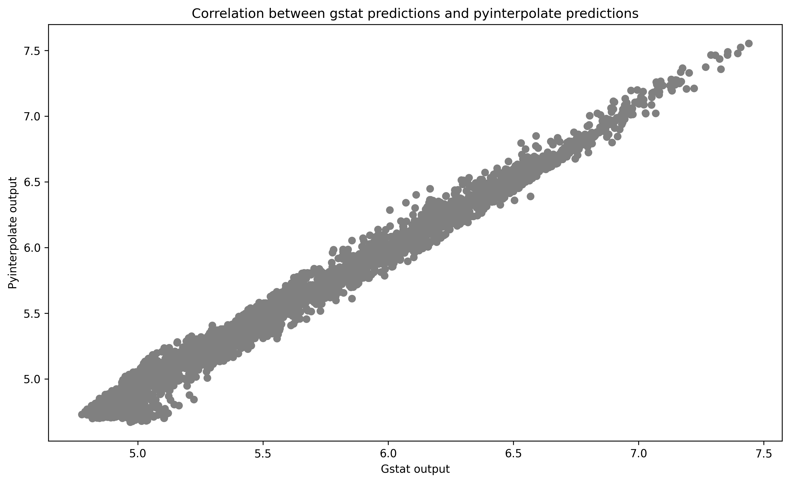
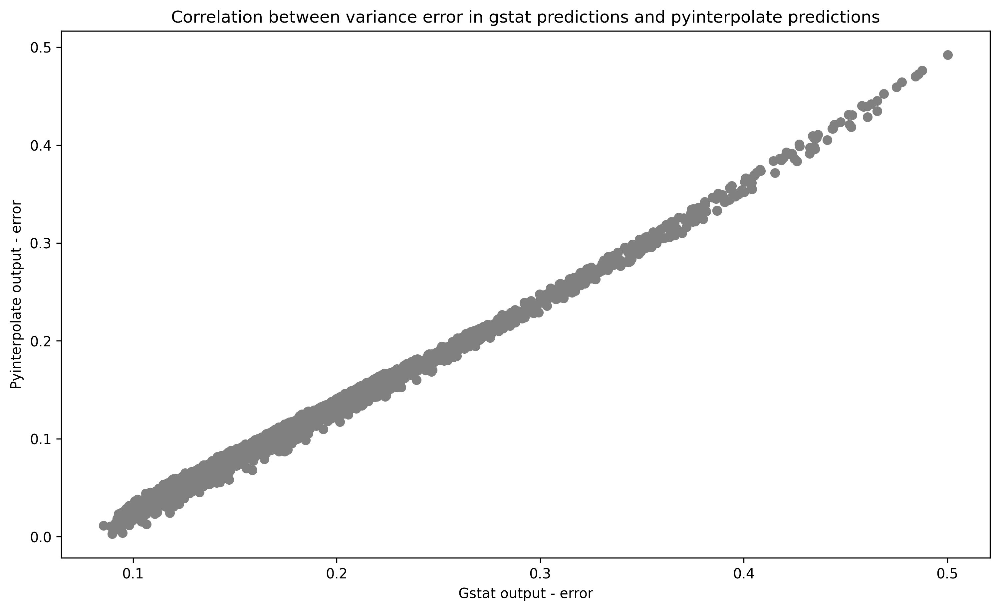
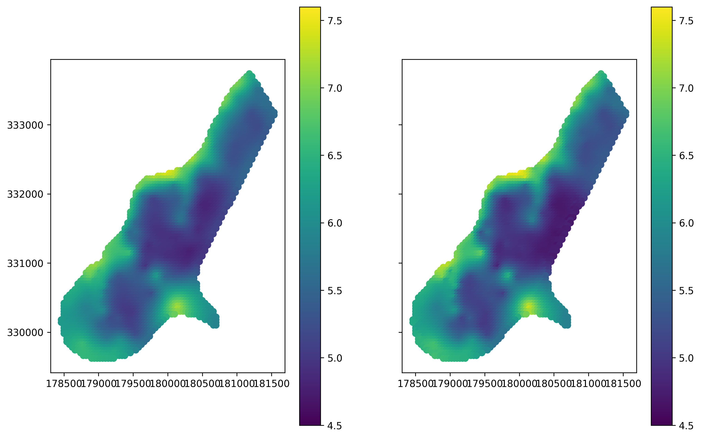
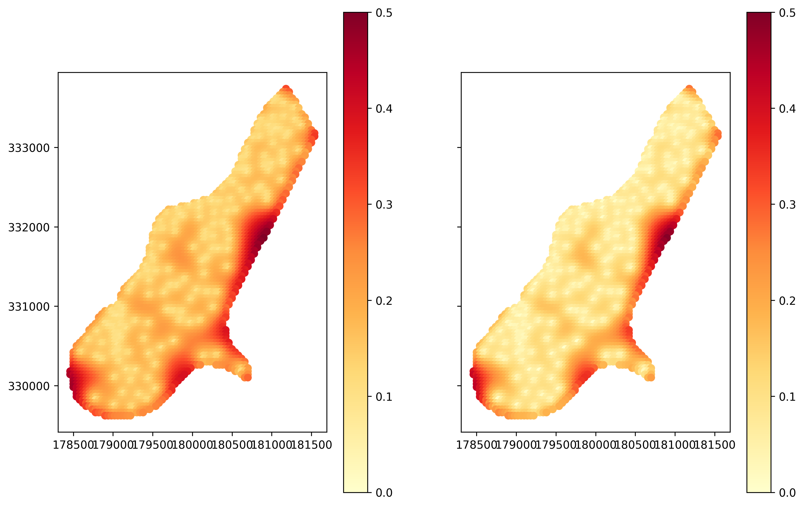

# Comparison of Ordinary Kriging in `Pyinterpolate` and `gstat` package

Up to date the most popular package for Kriging is **gstat** [1] written in the R programming language. Existence of this software allows to compare **point Kriging** operations between packages. The `meuse` dataset provided with the R package **sp** [2; 3] is used in this example. This dataset contains measurements of four heavy metals concentration in the top soil in a flood plain along the river Meuse [4]. Code for this comparison is given in the dedicated notebook available in the [paper repository](https://github.com/SimonMolinsky/pyinterpolate-paper/tree/main/paper-examples/example-gstat-comparison).

From four metals concentration of zinc is used in this example. Variogram modeling and kriging are performed semi-automatically in both cases with a common setting related to the kriging itself - with the number of neighbours. Variogram modeling is different. In the case of **gstat** package variogram was derived as a Spherical model with nugget equal to the first three values of experimental semivariances, sill is equal to the mean of the last five values of experimental semivariances and range which is 1/3 of the maximum distance. Lags between steps are not equal. On the contrary, **pyinterpolate** fits a semivariogram automatically based on the lowest RMSE between theoretical model and experimental values. It is an iterative process. Function searches for the optimal range and sill pair and model type; it performs grid search. Model, sill and range with the lowest RMSE is selected as the optimal model. This process is repeated for each type of theoretical model. In this case the Spherical model is the best. Nugget is equal to zero. Interpolation grid (points) is derived from the **sp** package.

The ordinary Kriging interpolation is performed for both packages. Predictions and prediction variance error terms are calculated and compared. Scatterplot of **pyinterpolate** output versus **gstat** output is presented in the Figure 1. Calculated Pearson correlation coefficient between both outputs is extremely high and close to the 0.99 with p-value close to the 0. Small differences may be related to the slightly different ranges of both models.

 
 
*Figure 1: Correlation between predicted values from the pyinterpolate package and the gstat package.*

Similar pattern may be observed for error variance estimates:

 
 
*Figure 2: Correlation between the predicted error variance from the pyinterpolate package and the gstat package.*

 
 Pattern of predicted values and variance errors are very similar in both cases. Figure 3 shows predicted output of **gstat** package and **pyinterpolate** and Figure 4 shows maps of variance errors from the both packages.
 
  
  
 *Figure 3: Comparison of predicted values from gstat (on the left) and pyinterpolate (on the right) packages.*
 
  
  
*Figure 4: Comparison of prediction errors from gstat (on the left) and pyinterpolate (on the right) packages.*
  
---
  
# Bibliography

**1) Pebesma E.J., Multivariable geostatistics in S: the gstat package**

```
{,
title = "Multivariable geostatistics in S: the gstat package",
journal = "Computers & Geosciences",
volume = "30",
number = "7",
pages = "683 - 691",
year = "2004",
issn = "0098-3004",
doi = "https://doi.org/10.1016/j.cageo.2004.03.012",
url = "http://www.sciencedirect.com/science/article/pii/S0098300404000676",
author = "Edzer J Pebesma",
keywords = "Kriging, Cokriging, Linear model of coregionalisation, Open source software, S language, Stochastic simulation"
}
```

**2) Pebesma E.J. and Bivand R.S., Classes and methods for spatial data in {R}**

```
{,
    author = {Edzer J. Pebesma and Roger S. Bivand},
    title = {Classes and methods for spatial data in {R}},
    journal = {R News},
    year = {2005},
    volume = {5},
    number = {2},
    pages = {9--13},
    month = {November},
    url = {https://CRAN.R-project.org/doc/Rnews/},
  }
```

**3) Bivand R.S., Pebesma E.J. and Gomez-Rubio V., Applied spatial data analysis with {R}, Second edition**

```
{,
    author = {Roger S. Bivand and Edzer Pebesma and Virgilio
      Gomez-Rubio},
    title = {Applied spatial data analysis with {R}, Second edition},
    year = {2013},
    publisher = {Springer, NY},
    url = {https://asdar-book.org/},
  }
```

**4) Pebesma E.J., The meuse data set: a tutorial for the gstat R package**

```
{,
    author = {Edzer J. Pebesma},
    title = {The meuse data set: a tutorial for the gstat R package},
    year = {2021},
    url = {https://cran.r-project.org/web/packages/gstat/vignettes/gstat.pdf},
}
```